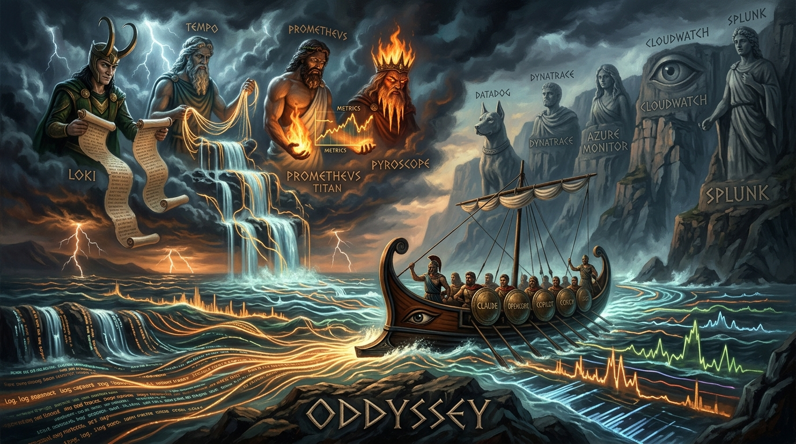

# oddyssey



**A CLI toolbox for Observability-Driven Development (ODD).**

[](https://github.com/using-system/oddyssey/actions/workflows/ci-mcp-server.yml)
[](https://pypi.org/project/oddyssey-mcp/)
[](LICENSE)

## Install

### With APM (every CLI)

With [APM](https://microsoft.github.io/apm/), for Claude Code:

```bash
uvx --from 'apm-cli==0.28.0' apm install --global --target claude using-system/oddyssey
```

Same command for every other supported CLI agent — swap the target:
`--target opencode`, `copilot`, `kiro`, `cursor`, `codex`, `gemini`,
`windsurf`. Drop `--global` to install into the current repository
only.

To update an existing install to the latest version:

```bash
uvx --from 'apm-cli==0.28.0' apm update --global --target claude using-system/oddyssey
```

It shows the update plan and asks for confirmation (`--yes` to skip,
`--dry-run` to only look); `apm outdated` tells you whether an update
is worth running.

### From the native marketplaces (no APM)

**Claude Code**

```
/plugin marketplace add using-system/oddyssey
/plugin install oddyssey@oddyssey-plugin
```

**GitHub Copilot CLI**

```
copilot plugin marketplace add using-system/oddyssey
copilot plugin install oddyssey@oddyssey-plugin
```

**Kimi Code**

```
/plugin marketplace add using-system/oddyssey
/plugin install oddyssey@oddyssey-plugin
```

**Codex** — this repository publishes the Codex manifest at
`.agents/plugins/marketplace.json`; add the repository as a plugin
source in your Codex plugins settings.

The native artifacts are generated from the APM package on every
release (`marketplace/`, built by `scripts/build-marketplace.sh`) and
carry the same agents, commands, skills, and pinned MCP server. The
other CLIs (opencode, Cursor, Windsurf, Kiro, Gemini) install via APM
above.

## The idea

ODD complements Spec-Driven Development: observe a running service — local
or remote — through its telemetry, turn what you see into the next SDD wave
(spec, plan, implement), then observe again. A continuous improvement loop,
indefinitely.

Everything is built on OpenTelemetry. For **local** observation, the MCP
server pilots a complete Grafana stack (UI, traces, metrics, logs,
profiles) that agents use to observe and fix. For **remote** environments,
observation works against a Grafana stack or any other OpenTelemetry
backend (Datadog, Dynatrace, Azure Monitor, CloudWatch, Splunk, ...).

oddyssey provides:

- **an OpenTelemetry expert** ([`otel-instrumentation-expert`](.apm/agents/otel-instrumentation-expert.agent.md))
  that investigates your stack and hands your CLI agent everything needed
  to integrate OpenTelemetry and deploy collectors;
- **a run investigation agent** ([`observe-run`](.apm/agents/observe-run.agent.md)),
  local or remote, that delivers a complete observation report your CLI
  agent turns into a spec-driven plan of fixes and improvements;
- **a complete local observability stack** based on Grafana, piloted by
  the oddyssey MCP server;
- **an ODD memory carried by the repo itself** — every observation and
  instrumentation report lands in `.odd/`, committed and versioned with
  the code, shared with the whole team, and recalled as the baseline of
  the next run: the loop accumulates knowledge instead of starting
  blind.

Everything is packaged for any coding agent
([APM](https://microsoft.github.io/apm/): Claude Code, Copilot, Cursor,
Codex, Gemini, and friends).

## How to

The loop in three prompts — every example below links to a real artifact
from this repository: oddyssey instrumented, observed, and verified its
own MCP server.

**Step 1 — Instrument OpenTelemetry.**

```text
/odd-instrument add OpenTelemetry to my project XXX
```

The `otel-instrumentation-expert` agent investigates the codebase,
stores its report in `.odd/otel-instrumentation-reports/` (committed —
the next investigation starts from it), and hands back everything a
spec-driven wave needs. Real output of that wave on this repo: the
[design spec](docs/superpowers/specs/2026-08-22-mcp-otel-instrumentation-design.md)
and the
[implementation plan](docs/superpowers/plans/2026-08-22-mcp-otel-instrumentation.md)
generated with [superpowers](https://github.com/obra/superpowers) from
the agent's investigation report.

**Step 2 — Observe a local run.**

```text
/odd-observe check that my project XXX starts and answers requests on the /user endpoint
```

The `observe-run` agent drives the run, queries the telemetry, and
stores its report in `.odd/observe-run-reports/` — findings, evidence,
and the replay protocol the verification will consume. Real example: the
[first observation report](.odd/observe-run-reports/2026-08-22-2154-mcp-otel-instrumentation-verification.md)
(4 confirmed findings) and the
[fix-wave plan](docs/superpowers/plans/2026-08-23-mcp-otel-fix-wave.md)
the next SDD wave built from it.

**Step 3 — Verify the fixes the SDD wave delivered.**

```text
/odd-verify check that report XXX from .odd has been fixed
```

The same agent replays the stored report's protocol and rules on every
recorded item — before-value, after-value, pass criterion. Real example:
the
[verification report](.odd/observe-run-reports/2026-08-22-2227-mcp-otel-fix-wave-verification.md)
— 9/9 checks pass, all 4 findings fixed, measured not assumed.

Then deploy, observe remotely, and start the loop again.

## The ODD principles

- **The system must be observable locally.** Prefer a docker-compose
  that starts your whole stack, and mocks for the remote systems it
  queries — the oddyssey MCP server provides the local observability
  backend the telemetry lands in.
- **Instrument with the expert.** Bring OpenTelemetry into your
  services through the `otel-instrumentation-expert` agent rather than
  by hand.
- **One design loop, always the same.** Every feature follows: SDD to
  develop it → observe a local run → fix and improve → repeat those
  last two steps until satisfied. Then deploy to the target
  environments. After some time, run a remote observation on the
  environment to seed the next SDD wave — and the loop starts again
  from the local run.
- **Maturity spaces observation out.** The time between remote
  observations grows as the service matures: a young service gets
  observed often, a stable one only when something is worth learning.
- **Evidence over impressions.** Every claim about a service comes from
  a query and its result — numbers, trace IDs, log lines — never "it
  seems faster".
- **Cross-confirm before concluding.** Never conclude from one signal
  what two could confirm (traces, metrics, logs, profiles); a
  single-signal anomaly is always labeled as such.
- **The memory lives with the code.** Observation reports are stored in
  the observed repo under `.odd/` — version that directory (do not add
  it to `.gitignore`): the reports get reviewed in PRs, shared by the
  whole team, and the git history reads observed → fixed → verified.
- **Verify by replaying, not by re-measuring differently.** A fix is
  proven by replaying the recorded scenario identically; one changed
  variable invalidates the before/after comparison.
- **What's missing is a finding too.** Telemetry gaps — absent spans,
  logs without trace IDs, missing histograms — are deliverables of the
  observation and feed the next instrumentation wave.
- **One telemetry, two consumers.** The metrics, traces, and logs do not
  serve ODD alone: the same data feeds classic runtime observability —
  dashboards, alerting, incident investigation. Instrument once, and the
  development loop and the operation of the system read from the same
  source of truth.
- **Agents observe, they never fix.** The investigation agents only
  observe and report — they never modify the code directly. Their report
  is a universal input: feed it to any spec-driven framework for the
  spec-and-implement wave, turn it into JIRA tickets, or hand it to a
  human — what happens next stays your call.

## Prerequisites

- **[Docker](https://docs.docker.com/get-docker/)** — runs the local
  observability stack (the MCP server drives it directly).
- **[gcx](https://github.com/grafana/gcx)** — required only when observing
  a **Grafana** backend (the local stack, self-hosted, or Grafana Cloud):
  `brew install gcx`, or
  `curl -fsSL https://raw.githubusercontent.com/grafana/gcx/main/scripts/install.sh | sh`.
- **Other backends** need their own CLI, each covered by the
  [`observability-cli-guides`](.apm/skills/observability-cli-guides/SKILL.md)
  skill: Datadog ([Pup](https://github.com/DataDog/pup)), Dynatrace
  ([dtctl](https://github.com/dynatrace-oss/dtctl)), Azure Monitor
  (`az`), AWS CloudWatch/X-Ray (`aws`), Splunk (`splunk`).

## The MCP server

One job: **pilot a local Grafana stack with an OpenTelemetry endpoint**.
One container ([grafana/otel-lgtm](https://github.com/grafana/docker-otel-lgtm),
pinned, its definition embedded in the server — Docker is the only
prerequisite) exposes Grafana on `:3000` and OTLP on `:4317`/`:4318`; apps
export their telemetry there. Tempo traces, Prometheus metrics, Loki
logs, and Pyroscope profiles are all queried through the Grafana proxy
(`:3000/api/datasources/proxy/uid/...`), so the same paths work against any
Grafana; on remote environments the stack behind it can be something other
than the local otel-lgtm container.

| Tool | What it does |
| --- | --- |
| `odd_stack_up` | Start the local stack and wait until it is ready |
| `odd_stack_down` | Destroy it — stored telemetry does not survive |
| `odd_stack_status` | Probe whether it is up |
| `odd_stack_reset` | Wipe all stored telemetry and return a fresh, ready stack — the next run starts from a clean slate |

One stack per machine: every project observed on the same workstation shares
it, so `odd_stack_reset` (and `odd_stack_down`) destroys the telemetry of
every project, not just the current one. The reset result's `services_wiped`
field lists the `service.name` values that were stored, so an unexpected
name is the cue to warn before wiping.

The server is instrumented with OpenTelemetry and, by default, exports its
own traces and metrics to the local stack (`http://localhost:4318`, OTLP
`http/protobuf` — the protocol is fixed, `OTEL_EXPORTER_OTLP_PROTOCOL` set
to anything else is not honored). Any `OTEL_*` variable set in the MCP
client's env block overrides the defaults, and `OTEL_SDK_DISABLED=true`
turns telemetry off entirely. When the stack is down, telemetry is silently
dropped — the normal state, and never a failure of the server.

## The agents and skills

| Primitive | Role |
| --- | --- |
| [`otel-instrumentation-expert`](.apm/agents/otel-instrumentation-expert.agent.md) (agent) | Investigate a codebase and hand back every input for a spec-driven plan to implement OpenTelemetry: stack inventory, per-service approach sourced from the official docs, open decisions, verification protocol |
| [`observe-run`](.apm/agents/observe-run.agent.md) (agent) | Observe a running service — on the local stack or any remote backend — through its telemetry (metrics, traces, logs, profiles) and hand back every input for a spec-driven plan of fixes and improvements |
| [`otel-guides`](.apm/skills/otel-guides/SKILL.md) (skill) | Curated map of the official OpenTelemetry docs: every supported language plus the cross-language guides (SDK configuration, semantic conventions, Collector deployment) |
| [`setup-local-stack`](.apm/skills/setup-local-stack/SKILL.md) (skill) | Configure gcx against the local stack without touching the user's contexts, with the datasource UIDs and the push-model caveats |
| [`observability-cli-guides`](.apm/skills/observability-cli-guides/SKILL.md) (skill) | Curated map of every major backend's terminal query surface: Grafana (gcx), Datadog (Pup), Dynatrace (dtctl), Azure Monitor (az), CloudWatch (aws), Splunk |
| [`run-scenario`](.apm/skills/run-scenario/SKILL.md) (skill) | Drive a reproducible request scenario against a local service and record it verbatim, so the same numbers are measurable before a fix and after it |
| [`create-observe-run-report`](.apm/skills/create-observe-run-report/SKILL.md) (skill) | The ODD loop's memory: persist each observation report into the observed repo (`.odd/observe-run-reports/`) and recall the previous ones as the next run's baseline |
| [`create-otel-instrumentation-report`](.apm/skills/create-otel-instrumentation-report/SKILL.md) (skill) | Same memory for the instrumentation side: persist each investigation into the investigated repo (`.odd/otel-instrumentation-reports/`) and recall it before the next one |
| [`/odd-observe`](.apm/prompts/odd-observe.prompt.md) (prompt) | Entry point: build a well-formed mission from your arguments and invoke the `observe-run` agent |
| [`/odd-instrument`](.apm/prompts/odd-instrument.prompt.md) (prompt) | Entry point: point the `otel-instrumentation-expert` agent at a codebase |
| [`/odd-verify`](.apm/prompts/odd-verify.prompt.md) (prompt) | Entry point: replay a stored report's protocol through the `observe-run` agent — a full observation report again, this time ruling on everything the previous one recorded: measurements, anomalies, telemetry gaps |

The loop: **investigate** (agents) → **spec & implement** (the main
agent's spec-driven workflow) → **observe again** — telemetry on both
ends. Each observation report is stored in the observed repo
(`.odd/observe-run-reports/`), versioned by git and shared with the whole
team, and becomes the baseline the next run diffs against — the loop
accumulates knowledge instead of starting blind.

## Development

The exact build, test, and lint commands live in
[CONTRIBUTING.md](CONTRIBUTING.md) — single source, matching what CI
enforces. In short: the project under `src/` is a self-contained uv
project (own `pyproject.toml`); `tests/` mirrors `src/`.

## Contributing

Issues, docs fixes, and code are welcome — see
[CONTRIBUTING.md](CONTRIBUTING.md) for the layout, the exact build/test
commands, and the PR conventions (squash titles drive the released
version). Questions and ideas belong in
[Discussions](https://github.com/using-system/oddyssey/discussions);
[good first issues](https://github.com/using-system/oddyssey/issues?q=is%3Aopen+label%3A%22good+first+issue%22)
are waiting.

## License

[MIT](LICENSE)
