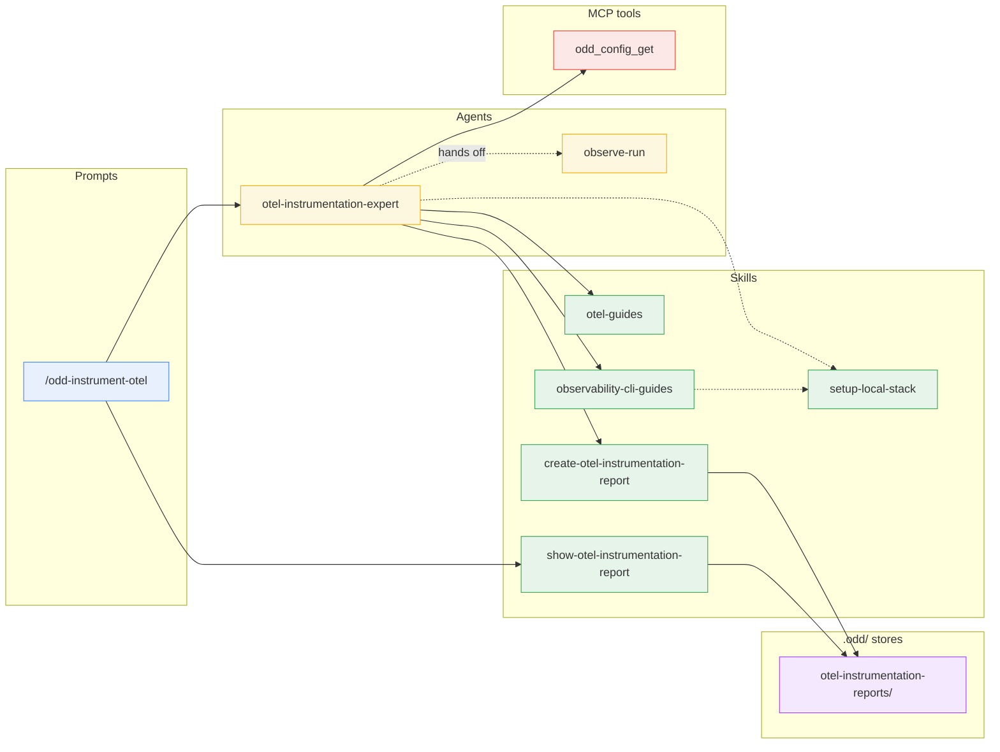
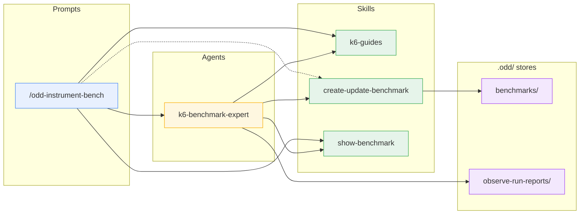
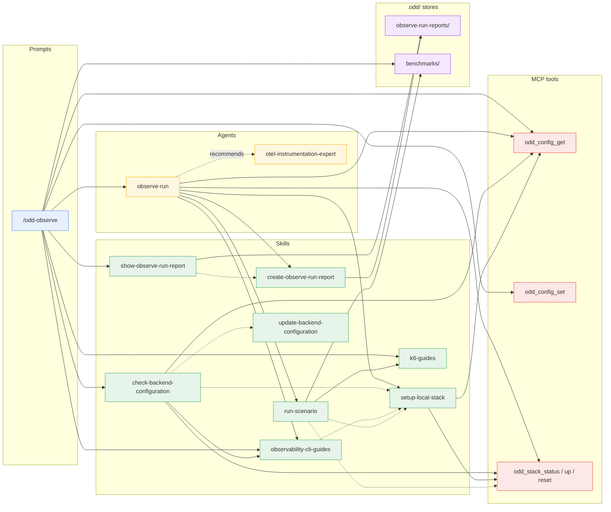
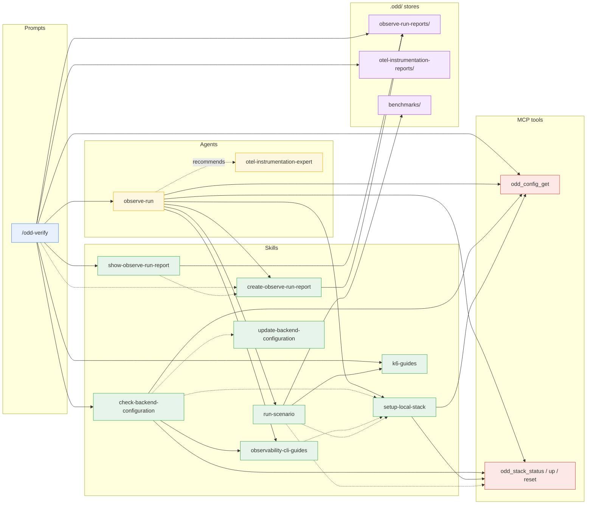
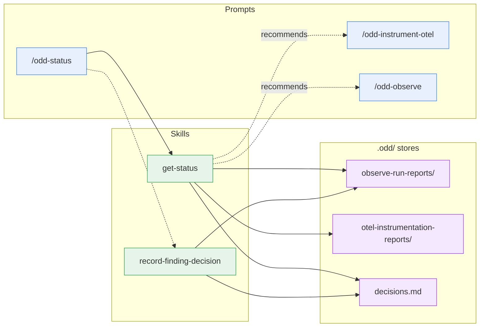
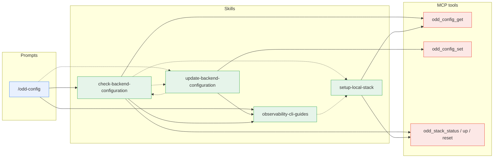
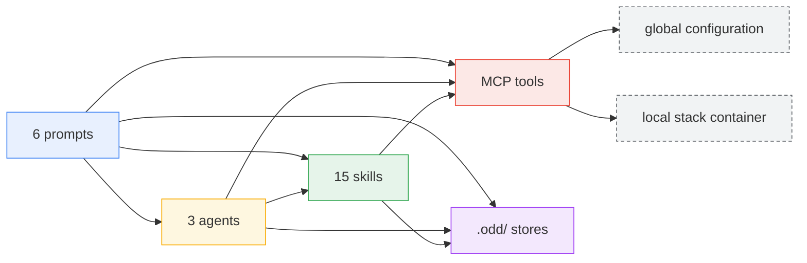

# Component dependency map

Who invokes what across the package's three layers - prompts, agents,
skills - plus the MCP server tools and the report stores. Every edge
matches an actual invocation in the `.apm/` sources; the per-layer
tables at the end are the component catalog. One diagram per prompt,
limited to that prompt's reachable subgraph; a component from another
prompt's path appears as a **boundary node**, expanded in its own
diagram.

## Legend

- **Layers**: prompts (user entry points) - agents (dispatched
  missions) - skills (reusable contracts) - MCP tools (the oddyssey
  server piloting the local stack and the global configuration) -
  stores (the committed `.odd/` report directories, plus the findings
  decision ledger `.odd/decisions.md` and the benchmark sources under
  `.odd/benchmarks/`).
- **Edges**: solid `-->` = dispatch or direct invocation; dashed
  `-.->` = routing or contract reference (one component hands over to
  or follows another's rules); dotted with label = recommendation or
  hand-off (one component points the user, or the next step, at
  another).

## /odd-instrument-otel

Dispatches `otel-instrumentation-expert`, which maps services to the
official docs, takes the protocol's queries from the export stack's
`observability-cli-guides` reference (validating them locally through
`setup-local-stack`'s gcx context), persists through
`create-otel-instrumentation-report`, and closes with
`show-otel-instrumentation-report`'s synthesis.
`observe-run` is a boundary node: the report hands it the confirmation
of landed signals.

## /odd-instrument-bench

Asks the user what only a human decides, ensures `k6` is present per
`k6-guides`, dispatches `k6-benchmark-expert`, which persists through
`create-update-benchmark`, and closes with `show-benchmark`'s
synthesis.

## /odd-observe

Preflights in the main conversation - the stack through
`odd_config_get`/`odd_config_set`, the CLI through
`check-backend-configuration`, `k6` through `k6-guides` when a
benchmark is named - then dispatches `observe-run` and closes with
`show-observe-run-report`'s synthesis. `otel-instrumentation-expert`
is a boundary node, recommended when a service emits no telemetry.

## /odd-verify

Resolves the baseline across both `.odd/` stores, preflights against
the report's `stack` (never `odd_config_set` here), follows
`create-observe-run-report`'s verification rules, ensures `k6` when a
drive replay carries a benchmark, dispatches `observe-run`, and closes
with `show-observe-run-report`'s synthesis. `otel-instrumentation-expert`
is the same boundary node as in `/odd-observe`.

## /odd-status

Dispatches no agent: `get-status` renders the loop's state from both
stores, git, and the decisions ledger; `record-finding-decision` runs
only when the user asks for a decision, and the prompt re-renders
afterwards. The two recommended prompts are boundary nodes.

## /odd-config

Displays through `check-backend-configuration` and routes a switch
to `update-backend-configuration`, which hands back for the connection
proof; the routing runs the other way for a missing CLI binary or a
targeting value that fails to resolve.

## Prompts

The user entry points. Each builds a mission from the arguments, runs
its preflight in the main conversation, dispatches (or routes to
skills), and closes with a show skill's synthesis of what was stored.

| Prompt | Role | Invokes |
| --- | --- | --- |
| [`/odd-instrument-otel`](../../.apm/prompts/odd-instrument-otel.prompt.md) | Entry point: point the `otel-instrumentation-expert` agent at a codebase | `otel-instrumentation-expert`; `show-otel-instrumentation-report` |
| [`/odd-instrument-bench`](../../.apm/prompts/odd-instrument-bench.prompt.md) | Entry point: ask what only a human decides, ensure `k6`, then point the `k6-benchmark-expert` agent at a service | `k6-benchmark-expert`; `k6-guides` (`authoring-inputs.md`, `install.md`); `show-benchmark`; routes to `create-update-benchmark` for the recall when new-versus-update is ambiguous |
| [`/odd-observe`](../../.apm/prompts/odd-observe.prompt.md) | Entry point: resolve the stack, prove the CLI connected, resolve the depth, build the mission and invoke the `observe-run` agent | `observe-run`; `check-backend-configuration`; `observability-cli-guides` (`builtin-stacks.md`); `k6-guides` (`install.md`); `show-observe-run-report`; `odd_config_get`, `odd_config_set`; reads `.odd/benchmarks/` |
| [`/odd-verify`](../../.apm/prompts/odd-verify.prompt.md) | Entry point: replay a stored report's protocol through the `observe-run` agent and rule on everything it recorded; preflights against the report's stack and asks before a remote drive replay | `observe-run`; `check-backend-configuration`; `k6-guides` (`install.md`); `show-observe-run-report`; `odd_config_get`; follows `create-observe-run-report`'s verification rules; reads `.odd/observe-run-reports/`, `.odd/otel-instrumentation-reports/` |
| [`/odd-status`](../../.apm/prompts/odd-status.prompt.md) | Where is the loop? Rendered from the `.odd/` history and git alone; records decisions on findings. Dispatches no agent | `get-status`; routes to `record-finding-decision` when, and only when, the user asks for a decision on a finding, then re-renders |
| [`/odd-config`](../../.apm/prompts/odd-config.prompt.md) | Show the configured backend - stack, targeted instance, connection proof - and guide a backend switch | `check-backend-configuration`; `observability-cli-guides`; routes to `update-backend-configuration` when the user picks a backend |

## Agents

The dispatched missions. They investigate and report, never modify
the code, and persist through the create skills that own the stores.

| Agent | Role | Invokes |
| --- | --- | --- |
| [`otel-instrumentation-expert`](../../.apm/agents/otel-instrumentation-expert.agent.md) | Investigate a codebase and hand back every input for a spec-driven plan to implement OpenTelemetry | `otel-guides`; `observability-cli-guides` (the export stack's query surface, for the protocol's queries); routes to `setup-local-stack` to validate a query on the local stack; `create-otel-instrumentation-report`; `odd_config_get`; hands the confirmation of landed signals off to `observe-run` |
| [`observe-run`](../../.apm/agents/observe-run.agent.md) | Observe a running service through its telemetry, on the local stack or a remote backend, and hand back every input for a plan of fixes | `observability-cli-guides`; `setup-local-stack`; `run-scenario` (ad-hoc requests, or a stored benchmark run unmodified); `create-observe-run-report`; `odd_config_get`; `odd_stack_status` / `odd_stack_up` / `odd_stack_reset`; recommends `otel-instrumentation-expert` when a named service emits no telemetry at all |
| [`k6-benchmark-expert`](../../.apm/agents/k6-benchmark-expert.agent.md) | Investigate a service and author its k6 benchmark as reviewed code, validated but never run as a benchmark | `k6-guides` (`scripting.md`, `running-tests.md`); `create-update-benchmark`; `show-benchmark`; reads `.odd/observe-run-reports/` for the service's hot operations |

## Skills

The reusable contracts. A skill invokes another only where an edge is
drawn: the guides and the show skills invoke nothing, the create
skills own their store, and the two configuration skills route to
each other.

| Skill | Role | Invokes |
| --- | --- | --- |
| [`otel-guides`](../../.apm/skills/otel-guides/SKILL.md) | Curated map of the official OpenTelemetry docs: every supported language plus the cross-language guides (SDK configuration, semantic conventions, Collector deployment) | Nothing |
| [`k6-guides`](../../.apm/skills/k6-guides/SKILL.md) | Curated map of the official k6 docs: install, running a script, scripting (checks, thresholds, scenarios), test types, protocols - and which of a benchmark's inputs a human must decide rather than an agent | Nothing |
| [`observability-cli-guides`](../../.apm/skills/observability-cli-guides/SKILL.md) | One reference per stack - query surface, configuration display, what to persist - plus the built-in stack list: the local stack, Grafana (gcx), Datadog (Pup), Dynatrace (dtctl), Azure Monitor (az), CloudWatch (aws), Splunk | Routes the local-stack case to `setup-local-stack` |
| [`setup-local-stack`](../../.apm/skills/setup-local-stack/SKILL.md) | Configure gcx against the local stack without touching the user's contexts, with the datasource UIDs and the push-model caveats | `odd_config_get`; `odd_stack_status` / `odd_stack_up` / `odd_stack_reset` |
| [`check-backend-configuration`](../../.apm/skills/check-backend-configuration/SKILL.md) | Before a run: display the configured stack's CLI context, prove it connected, guide the setup, and hand the preflight over to the mission | `observability-cli-guides` (`builtin-stacks.md`); `odd_config_get`; `odd_stack_status` / `odd_stack_up` / `odd_stack_reset`; routes to `setup-local-stack` for the local stack, and to `update-backend-configuration` for a missing CLI binary or a persisted targeting value that fails to resolve |
| [`update-backend-configuration`](../../.apm/skills/update-backend-configuration/SKILL.md) | Own the backend switch: CLI presence with a guided install offer, the switch and the per-stack `stack_config` values persisted | `observability-cli-guides` (`builtin-stacks.md`); `odd_config_set`; hands the verification back to `check-backend-configuration` |
| [`run-scenario`](../../.apm/skills/run-scenario/SKILL.md) | Drive a reproducible request scenario - ad-hoc requests or a stored benchmark - and record it verbatim for the replay | `k6-guides` (`running-tests.md`, `install.md`); reads `.odd/benchmarks/<name>/` (never writes there); orders the clean-base sequence around `odd_stack_reset` and follows `setup-local-stack` |
| [`create-observe-run-report`](../../.apm/skills/create-observe-run-report/SKILL.md) | The loop's memory: persist each observation report and recall the previous ones as the baseline | Owns `.odd/observe-run-reports/` - nothing else writes there |
| [`create-otel-instrumentation-report`](../../.apm/skills/create-otel-instrumentation-report/SKILL.md) | Same memory for the instrumentation side: persist each investigation into the investigated repo and recall it before the next one | Owns `.odd/otel-instrumentation-reports/` - nothing else writes there |
| [`create-update-benchmark`](../../.apm/skills/create-update-benchmark/SKILL.md) | Persist an authored benchmark (script + manifest) and recall the ones a service already has: living source, updated in place through reviewed diffs - not an append-only report | Owns `.odd/benchmarks/` - naming, recall by service and by name, the reviewed diff, the commit |
| [`show-observe-run-report`](../../.apm/skills/show-observe-run-report/SKILL.md) | Close an observe or verify mission with a one-screen synthesis of the stored report | Renders `create-observe-run-report`'s return value (stored path, carrying commit, the report as written); reads `.odd/observe-run-reports/` only for a stored report the caller names; writes nothing |
| [`show-otel-instrumentation-report`](../../.apm/skills/show-otel-instrumentation-report/SKILL.md) | Close an instrument mission with a one-screen synthesis of the stored report | Reads `.odd/otel-instrumentation-reports/` under `create-otel-instrumentation-report`'s file contract; writes nothing |
| [`show-benchmark`](../../.apm/skills/show-benchmark/SKILL.md) | Close an authoring mission: render a short synthesis of the stored benchmark - stored path, what it exercises, next action - the script and manifest stay the deliverable | Nothing - it renders what `create-update-benchmark` just returned, and reads nothing else |
| [`get-status`](../../.apm/skills/get-status/SKILL.md) | Render the state of the ODD loop from the committed `.odd/` history and git alone, read-only | Reads `.odd/observe-run-reports/`, `.odd/otel-instrumentation-reports/`, and `.odd/decisions.md` (under `record-finding-decision`'s ledger contract, without calling it); recommends `/odd-instrument-otel` or `/odd-observe` |
| [`record-finding-decision`](../../.apm/skills/record-finding-decision/SKILL.md) | Record a maintainer decision on a finding into the committed ledger, never editing a report | Owns `.odd/decisions.md` - the row format, the commit of that file alone; reads `.odd/observe-run-reports/` to resolve the finding reference |

## MCP tools

`odd_config_get` / `odd_config_set` read and write the global
configuration (stack, local ports, per-stack `stack_config`);
`odd_stack_status` / `odd_stack_up` / `odd_stack_reset` pilot the
local otel-lgtm container. They are the only components with machine
state - every prompt, agent, and skill above is a prose contract.

## Bird's-eye view

Layers only - the per-component edges live in the per-prompt diagrams
above, and so does the intra-layer routing (prompt-to-prompt
recommendations, the agents' mutual hand-off, skill-to-skill routing):
this view keeps only the cross-layer edges. The last block is not a
component layer but the **machine state** the MCP tools sit on - the
global configuration and the local stack container never appear in the
per-prompt diagrams because nothing invokes them directly: every
access goes through the tools.

