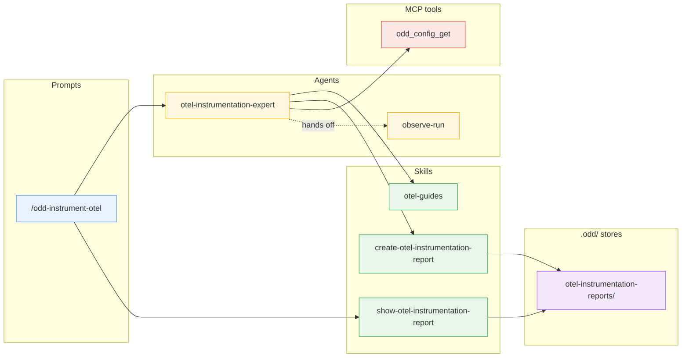
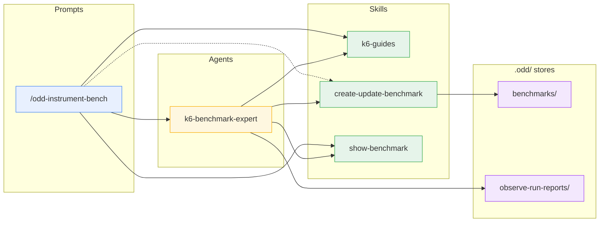
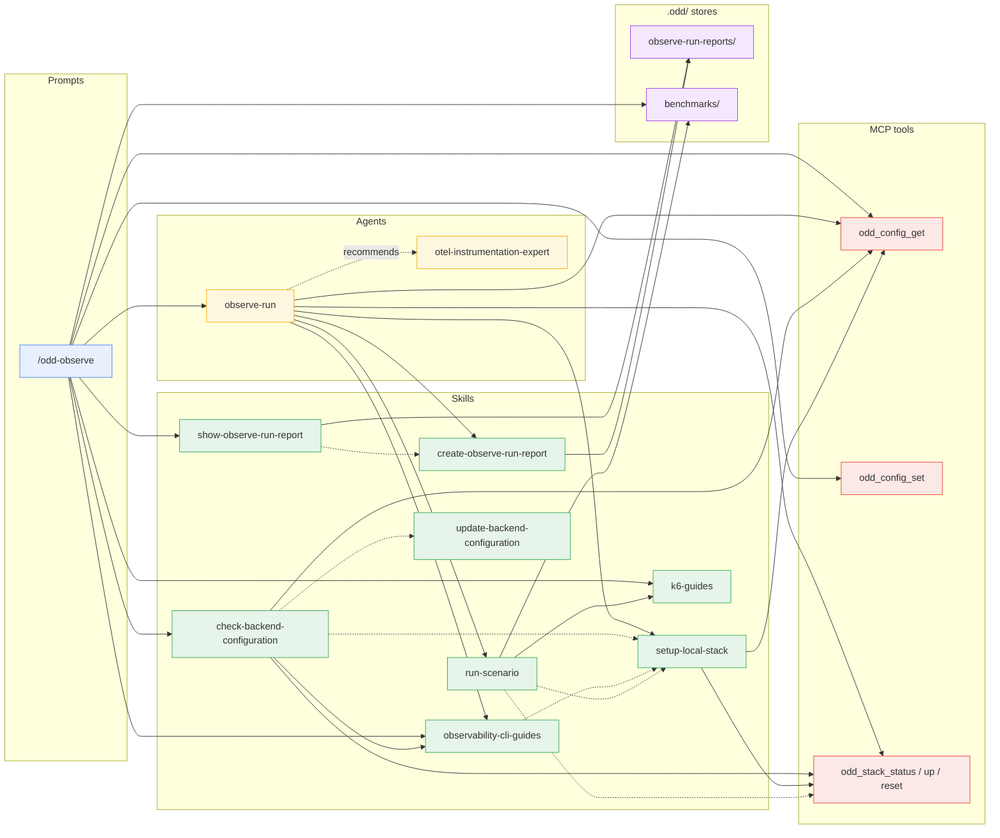
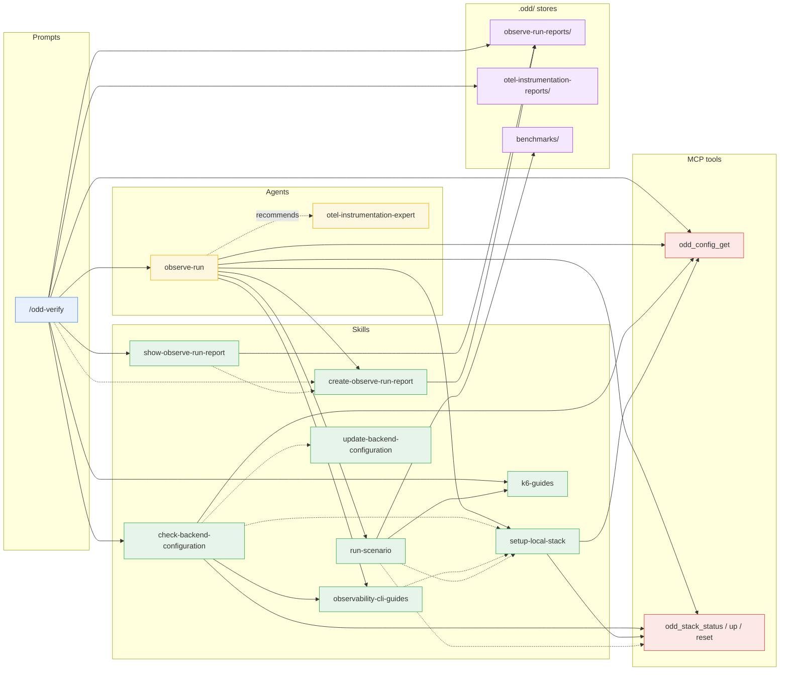
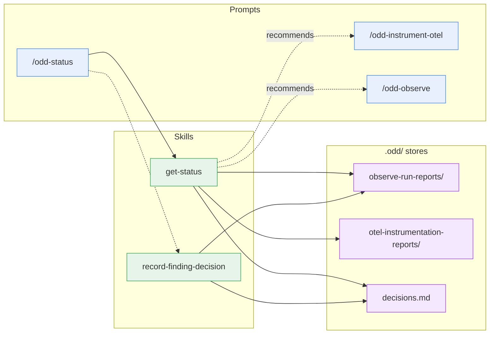
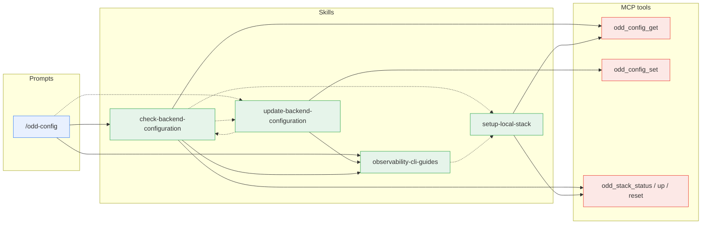
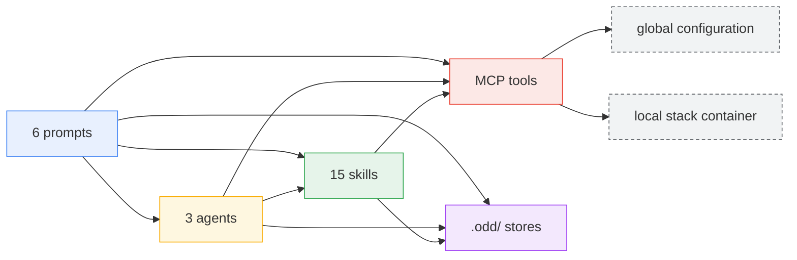

# Component dependency map

Who invokes what across the APM package's three layers - prompts,
agents, skills - plus the MCP server tools and the report stores.
Every edge below matches an actual invocation or routing statement in
the `.apm/` sources; the diagrams carry the structure, the paragraphs
carry the intent, and the per-layer tables at the end list every
component with its role and its edges.

The map is split into **one diagram per prompt**, each limited to that
prompt's reachable subgraph. Shared plumbing (the preflight routing,
the report skills owning the stores) repeats where reachable - a
little repetition is the price of legibility. A component that belongs
to another prompt's path appears only as a **boundary node** (the
target of a hand-off or recommendation edge), without its own
dependencies - the diagram named in the prose expands it.

## Legend

- **Layers**: prompts (user entry points) - agents (dispatched
  missions) - skills (reusable contracts) - MCP tools (the oddyssey
  server piloting the local stack and the global configuration) -
  stores (the committed `.odd/` report directories, plus the findings
  decision ledger `.odd/decisions.md` and the benchmark sources under
  `.odd/benchmarks/`).
- **Edges**: solid `-->` = dispatch or direct invocation; dashed
  `-.->` = routing or contract reference (one component hands over to
  or follows another's rules); dotted with label = recommendation or
  hand-off (one component points the user, or the next step, at
  another).

## /odd-instrument-otel

A dispatcher to `otel-instrumentation-expert`, which maps
services to the official docs (`otel-guides`), reads effective ports
from `odd_config_get`, and persists through
`create-otel-instrumentation-report`. The prompt closes the mission
with `show-otel-instrumentation-report`, rendering a synthesis of the
stored report as the final answer. `observe-run` is a boundary node
here - the report hands the confirmation of landed signals to it, and
its own path is the `/odd-observe` diagram.

## /odd-instrument-bench

A dispatcher to `k6-benchmark-expert`, with one piece of work kept in
the main conversation: the prompt reads `k6-guides`' `authoring-inputs.md`
to know which dimensions only a human can decide, and asks about them
**before** any dispatch - calling `create-update-benchmark`'s recall
when new-versus-update stays ambiguous. The agent then investigates,
sources every k6 claim from `k6-guides`, reads the stored
`observe-run-reports/` for the service's known hot operations, hands
the mission back before persisting when a threshold sits below a floor
it found (the prompt re-dispatches with the caller's decision), and
persists the script and manifest through `create-update-benchmark`,
which owns `.odd/benchmarks/`. Both the agent and the prompt close on
`show-benchmark`, which renders only what `create-update-benchmark`
just wrote and returned - it never reads the store itself, hence no
edge to it. The prompt ensures the `k6` binary is present per
`k6-guides`' `install.md` (its auto-install step) before dispatching:
the agent validates the script with `k6 inspect` and one smoke
iteration at the target (both from `running-tests.md`). No MCP tool
appears here: authoring touches no stack and no configuration, and
never executes the benchmark.

## /odd-observe

The preflight runs in the main conversation first - resolve the stack
(`odd_config_get`, persisting a switch with `odd_config_set`) and
prove the CLI connected (`check-backend-configuration`); when the
arguments name a stored benchmark, the preflight also reads its
manifest under `.odd/benchmarks/` for the target service and ensures
the `k6` binary is present the way `k6-guides`' `install.md` says
(its auto-install step) - then the mission dispatches to
`observe-run`, and the prompt closes it with `show-observe-run-report`,
rendering a synthesis of the stored report as the final answer.
`otel-instrumentation-expert` is a boundary node - recommended when a
named service emits no telemetry at all; its path is the
`/odd-instrument-otel` diagram.

## /odd-verify

Resolves the baseline report across both `.odd/` stores, preflights
against the report's `stack` (never silently retargeting the
configured one - so no `odd_config_set` in this subgraph), resolves
the execution mode and asks the user before any drive replay on a
remote stack (whatever the report kind - before the CLI check and
before k6 is installed), mandates `create-observe-run-report`'s
verification rules for the report its agent will persist, ensures the
`k6` binary is present per `k6-guides`' `install.md` (its auto-install
step) when a drive replay carries a stored benchmark, dispatches to
`observe-run`, and closes the mission with `show-observe-run-report`'s
synthesis of the stored report - verdict first.
`otel-instrumentation-expert` is the same boundary node as in
`/odd-observe` - its path is the `/odd-instrument-otel` diagram.

## /odd-status

Dispatches no agent: a thin router over two skills, both running in
the main conversation. `get-status` renders - it reads both stores,
git, and the decisions ledger, read-only, and recommends the next loop
step. `record-finding-decision` runs only when the user asks for a
decision on a finding (in the arguments or as a follow-up): it resolves
the reference against the observation reports, appends a row to
`.odd/decisions.md`, commits that file alone, and the prompt then
re-renders through `get-status`. Neither skill invokes another
component; `get-status` reads the ledger through the format contract
`record-finding-decision` owns, but never calls it. The two
recommended prompts are boundary nodes - their paths are their own
diagrams.

## /odd-config

Composes two skills - display through
`check-backend-configuration`, and the backend switch routed to
`update-backend-configuration` when the user picks one, which verifies
by handing back to `check-backend-configuration`. The routing goes the
other way too: when the backend CLI's binary is absent, or — on the
backends whose reference defines a targeting proof — when a persisted
targeting value fails to resolve, `check-backend-configuration` routes
to `update-backend-configuration`: to its guided install offer in the
first case, to a correction of the stored value in the second.

## Prompts

The user entry points. Each builds a mission from the arguments, runs
its preflight in the main conversation, dispatches (or routes to
skills), and closes with a show skill's synthesis of what was stored.

| Prompt | Role | Invokes |
| --- | --- | --- |
| [`/odd-instrument-otel`](../../.apm/prompts/odd-instrument-otel.prompt.md) | Entry point: point the `otel-instrumentation-expert` agent at a codebase | `otel-instrumentation-expert`; `show-otel-instrumentation-report` |
| [`/odd-instrument-bench`](../../.apm/prompts/odd-instrument-bench.prompt.md) | Entry point: resolve what only a human can decide - test type, thresholds, target environment, new benchmark or an update, a smoke iteration at a remote target - ensure `k6` is present, then point the `k6-benchmark-expert` agent at a service to author its k6 benchmark | `k6-benchmark-expert`; `k6-guides` (`authoring-inputs.md`, `install.md`); `show-benchmark`; routes to `create-update-benchmark` for the recall when new-versus-update is ambiguous |
| [`/odd-observe`](../../.apm/prompts/odd-observe.prompt.md) | Entry point: resolve the stack, prove the CLI connected, resolve the depth from the arguments (asking only when they carry no signal), build a well-formed mission from the arguments and invoke the `observe-run` agent | `observe-run`; `check-backend-configuration`; `observability-cli-guides` (`builtin-stacks.md`); `k6-guides` (`install.md`); `show-observe-run-report`; `odd_config_get`, `odd_config_set`; reads `.odd/benchmarks/` |
| [`/odd-verify`](../../.apm/prompts/odd-verify.prompt.md) | Entry point: replay a stored report's protocol through the `observe-run` agent - a full observation report again, this time ruling on everything the previous one recorded: measurements, anomalies, telemetry gaps. Preflights against the report's `stack`, never retargeting the configured one, and asks before any drive replay on a remote stack. A replay with no fix under test persists as a re-measure, not a verification; the depth is the baseline's, `quick` for an observation baseline predating the field (said before dispatch), `full` for an instrumentation baseline | `observe-run`; `check-backend-configuration`; `k6-guides` (`install.md`); `show-observe-run-report`; `odd_config_get`; follows `create-observe-run-report`'s verification rules; reads `.odd/observe-run-reports/`, `.odd/otel-instrumentation-reports/` |
| [`/odd-status`](../../.apm/prompts/odd-status.prompt.md) | Where is the loop? Per-service state, findings ledger, trends, open telemetry gaps, and the next recommended action - read from the `.odd/` history and git alone, no backend queries - and record wontfix decisions on findings. Dispatches no agent | `get-status`; routes to `record-finding-decision` when, and only when, the user asks for a decision on a finding, then re-renders |
| [`/odd-config`](../../.apm/prompts/odd-config.prompt.md) | Show the configured backend - stack, targeted instance, connection proof - and guide a backend switch | `check-backend-configuration`; `observability-cli-guides`; routes to `update-backend-configuration` when the user picks a backend |

## Agents

The dispatched missions. They investigate and report, never modify
the code, and persist through the create skills that own the stores.

| Agent | Role | Invokes |
| --- | --- | --- |
| [`otel-instrumentation-expert`](../../.apm/agents/otel-instrumentation-expert.agent.md) | Investigate a codebase and hand back every input for a spec-driven plan to implement OpenTelemetry: stack inventory, per-service approach sourced from the official docs, open decisions, verification protocol | `otel-guides`; `create-otel-instrumentation-report`; `odd_config_get`; hands the confirmation of landed signals off to `observe-run` |
| [`observe-run`](../../.apm/agents/observe-run.agent.md) | Observe a running service - on the local stack or any remote backend - through its telemetry (metrics, traces, logs, profiles) and hand back every input for a spec-driven plan of fixes and improvements | `observability-cli-guides`; `setup-local-stack`; `run-scenario` (ad-hoc requests, or a stored benchmark run unmodified); `create-observe-run-report`; `odd_config_get`; `odd_stack_status` / `odd_stack_up` / `odd_stack_reset`; recommends `otel-instrumentation-expert` when a named service emits no telemetry at all |
| [`k6-benchmark-expert`](../../.apm/agents/k6-benchmark-expert.agent.md) | Investigate a service and author a k6 load-test benchmark - a script plus a manifest - as reviewed code under `.odd/benchmarks/`, every k6 claim sourced from the official docs; validates it with `k6 inspect` and one smoke iteration before persisting, never runs it as a benchmark | `k6-guides` (`scripting.md`, `running-tests.md`); `create-update-benchmark`; `show-benchmark`; reads `.odd/observe-run-reports/` for the service's hot operations |

## Skills

The reusable contracts. A skill invokes another only where an edge is
drawn: the guides and the show skills invoke nothing, the create
skills own their store, and the two configuration skills route to
each other.

| Skill | Role | Invokes |
| --- | --- | --- |
| [`otel-guides`](../../.apm/skills/otel-guides/SKILL.md) | Curated map of the official OpenTelemetry docs: every supported language plus the cross-language guides (SDK configuration, semantic conventions, Collector deployment) | Nothing |
| [`k6-guides`](../../.apm/skills/k6-guides/SKILL.md) | Curated map of the official k6 docs: install, running a script, scripting (checks, thresholds, scenarios), test types, protocols - and which of a benchmark's inputs a human must decide rather than an agent | Nothing |
| [`observability-cli-guides`](../../.apm/skills/observability-cli-guides/SKILL.md) | One reference per stack - query surface, configuration display, what to persist - plus the built-in stack list: the local stack, Grafana (gcx), Datadog (Pup), Dynatrace (dtctl), Azure Monitor (az), CloudWatch (aws), Splunk | Routes the local-stack case to `setup-local-stack` |
| [`setup-local-stack`](../../.apm/skills/setup-local-stack/SKILL.md) | Configure gcx against the local stack without touching the user's contexts, with the datasource UIDs and the push-model caveats | `odd_config_get`; `odd_stack_status` / `odd_stack_up` / `odd_stack_reset` |
| [`check-backend-configuration`](../../.apm/skills/check-backend-configuration/SKILL.md) | Before a run: display the configured stack's CLI context, prove it is connected, guide the user through the backend's setup, and close with the `Preflight:` handoff block the mission block carries - stack-agnostic, everything about a stack read from its `observability-cli-guides` reference (its `## CLI binary` and `## Configuration display` sections, never the whole file); never authenticates on their behalf | `observability-cli-guides` (`builtin-stacks.md`); `odd_config_get`; `odd_stack_status` / `odd_stack_up` / `odd_stack_reset`; routes to `setup-local-stack` for the local stack, and to `update-backend-configuration` for a missing CLI binary or a persisted targeting value that fails to resolve |
| [`update-backend-configuration`](../../.apm/skills/update-backend-configuration/SKILL.md) | Owns the backend switch: the target resolved from the built-in stack list, its CLI checked for presence with a guided install offer, the switch persisted, the per-stack `stack_config` values persisted per the stack's reference (its `## CLI binary` and `## What to persist` sections) | `observability-cli-guides` (`builtin-stacks.md`); `odd_config_set`; hands the verification back to `check-backend-configuration` |
| [`run-scenario`](../../.apm/skills/run-scenario/SKILL.md) | Drive a reproducible request scenario against a local service - ad-hoc requests, or a stored k6 benchmark run unmodified - and record it verbatim, so the same numbers are measurable before a fix and after it | `k6-guides` (`running-tests.md`, `install.md`); reads `.odd/benchmarks/<name>/` (never writes there); orders the clean-base sequence around `odd_stack_reset` and follows `setup-local-stack` |
| [`create-observe-run-report`](../../.apm/skills/create-observe-run-report/SKILL.md) | The ODD loop's memory: persist each observation report into the observed repo and recall the previous ones as the next run's baseline - naming, frontmatter contract, verification rules | Owns `.odd/observe-run-reports/` - nothing else writes there |
| [`create-otel-instrumentation-report`](../../.apm/skills/create-otel-instrumentation-report/SKILL.md) | Same memory for the instrumentation side: persist each investigation into the investigated repo and recall it before the next one | Owns `.odd/otel-instrumentation-reports/` - nothing else writes there |
| [`create-update-benchmark`](../../.apm/skills/create-update-benchmark/SKILL.md) | Persist an authored benchmark (script + manifest) and recall the ones a service already has: living source, updated in place through reviewed diffs - not an append-only report | Owns `.odd/benchmarks/` - naming, recall by service and by name, the reviewed diff, the commit |
| [`show-observe-run-report`](../../.apm/skills/show-observe-run-report/SKILL.md) | Close an observe or verify mission: render a one-screen synthesis of the stored report - verdict-first headline, stored path, findings that matter, next action - the raw report stays the loop's memory | Renders `create-observe-run-report`'s return value (stored path, carrying commit, the report as written); reads `.odd/observe-run-reports/` only for a stored report the caller names; writes nothing |
| [`show-otel-instrumentation-report`](../../.apm/skills/show-otel-instrumentation-report/SKILL.md) | Close an instrument mission: render a one-screen synthesis of the stored report - headline, stored path, plan-at-a-glance table, open decisions, next action - the raw report stays the plan's input | Reads `.odd/otel-instrumentation-reports/` under `create-otel-instrumentation-report`'s file contract; writes nothing |
| [`show-benchmark`](../../.apm/skills/show-benchmark/SKILL.md) | Close an authoring mission: render a short synthesis of the stored benchmark - stored path, what it exercises, next action - the script and manifest stay the deliverable | Nothing - it renders what `create-update-benchmark` just returned, and reads nothing else |
| [`get-status`](../../.apm/skills/get-status/SKILL.md) | Render the state of the ODD loop from the committed `.odd/` history and git alone - per-service loop state, findings ledger, trends, open telemetry gaps, next recommended action - read-only, no backend query, no report written | Reads `.odd/observe-run-reports/`, `.odd/otel-instrumentation-reports/`, and `.odd/decisions.md` (under `record-finding-decision`'s ledger contract, without calling it); recommends `/odd-instrument-otel` or `/odd-observe` |
| [`record-finding-decision`](../../.apm/skills/record-finding-decision/SKILL.md) | Record a maintainer decision on a finding - wontfix, or its reversal - into the committed ledger: the write that lets the status stop rendering a declined finding as open. Never edits a report | Owns `.odd/decisions.md` - the row format, the commit of that file alone; reads `.odd/observe-run-reports/` to resolve the finding reference |

## MCP tools

`odd_config_get` / `odd_config_set` read and write the global
configuration (stack, local ports, per-stack `stack_config`);
`odd_stack_status` / `odd_stack_up` / `odd_stack_reset` pilot the
local otel-lgtm container. They are the only components with machine
state - every prompt, agent, and skill above is a prose contract.

## Bird's-eye view

Layers only - the per-component edges live in the per-prompt diagrams
above, and so does the intra-layer routing (prompt-to-prompt
recommendations, the agents' mutual hand-off, skill-to-skill routing):
this view keeps only the cross-layer edges. The last block is not a
component layer but the **machine state** the MCP tools sit on - the
global configuration and the local stack container never appear in the
per-prompt diagrams because nothing invokes them directly: every
access goes through the tools.

