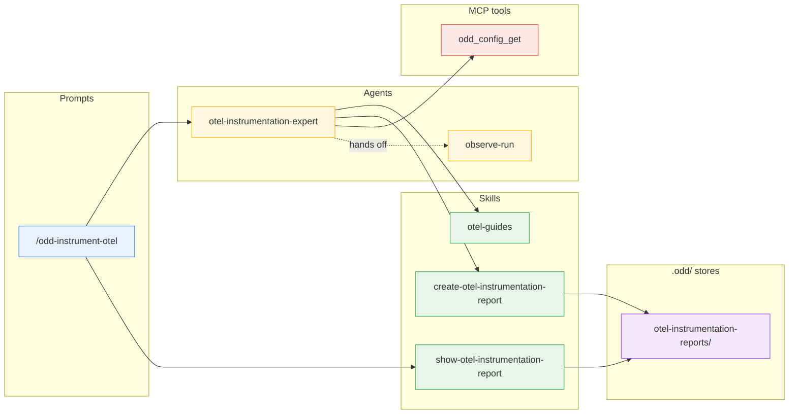
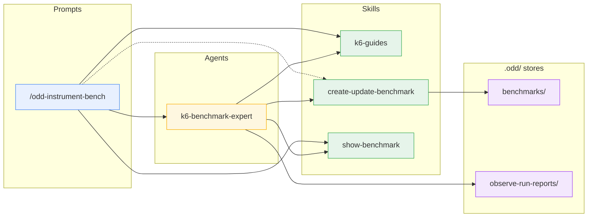
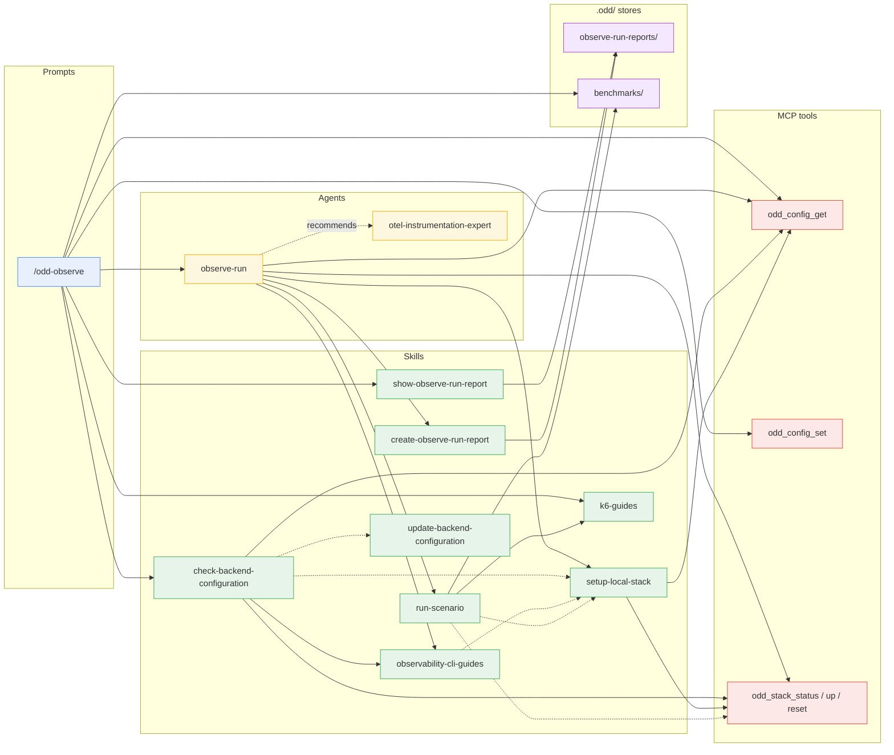
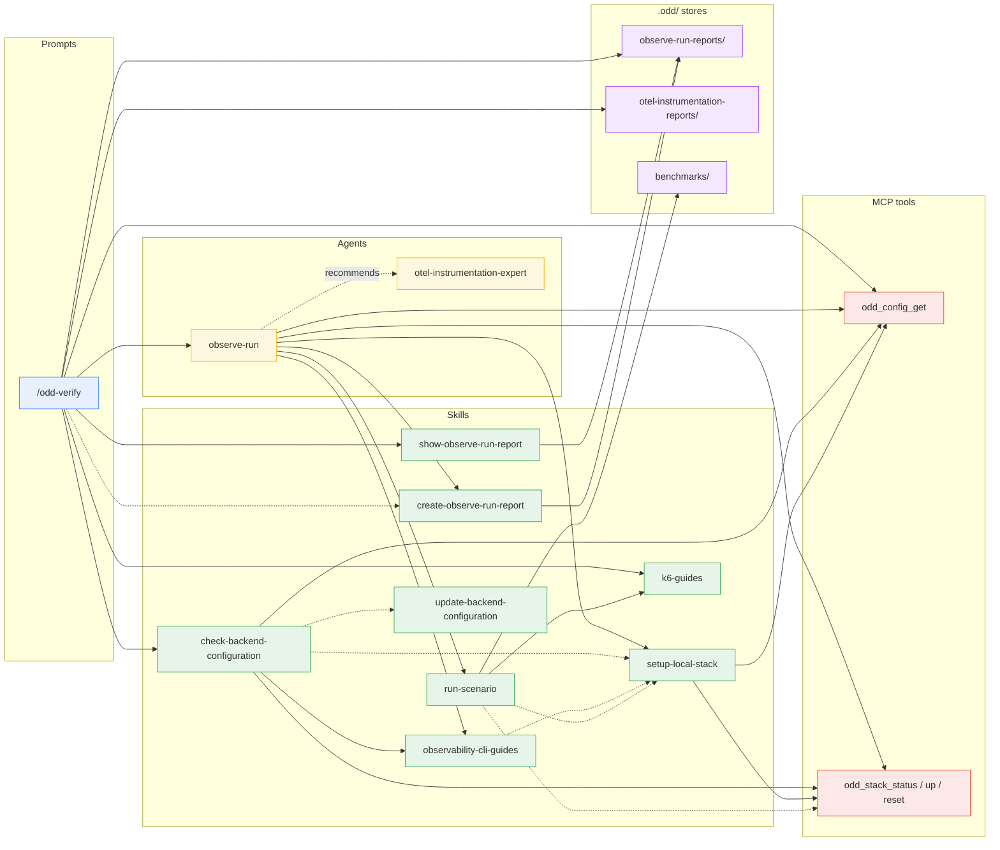
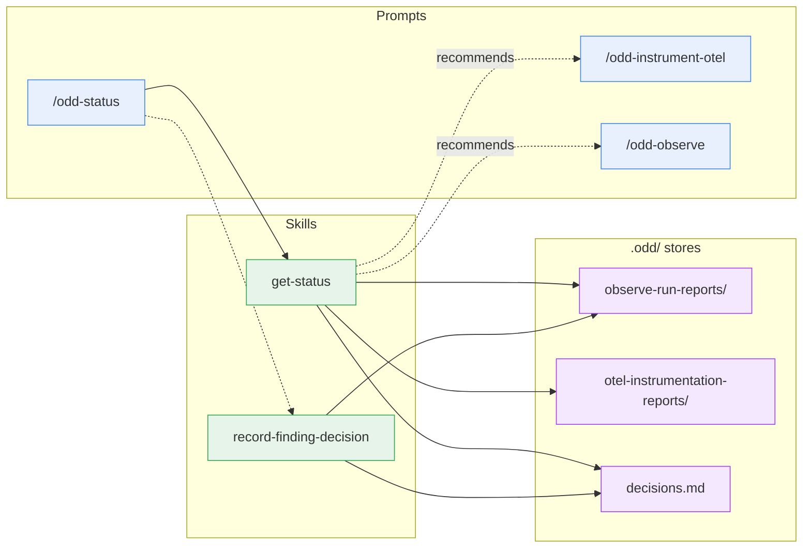
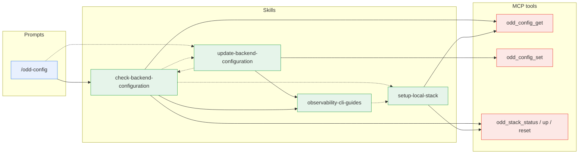
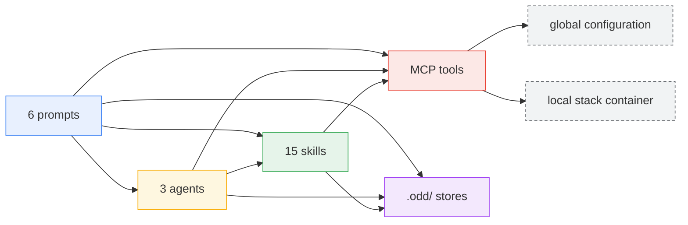

# Component dependency map

Who invokes what across the APM package's three layers - prompts,
agents, skills - plus the MCP server tools and the report stores.
Every edge below matches an actual invocation or routing statement in
the `.apm/` sources; the diagrams carry the structure, the paragraphs
carry the intent.

The map is split into **one diagram per prompt**, each limited to that
prompt's reachable subgraph. Shared plumbing (the preflight routing,
the report skills owning the stores) repeats where reachable - a
little repetition is the price of legibility. A component that belongs
to another prompt's path appears only as a **boundary node** (the
target of a hand-off or recommendation edge), without its own
dependencies - the diagram named in the prose expands it.

## Legend

- **Layers**: prompts (user entry points) - agents (dispatched
  missions) - skills (reusable contracts) - MCP tools (the oddyssey
  server piloting the local stack and the global configuration) -
  stores (the committed `.odd/` report directories, plus the findings
  decision ledger `.odd/decisions.md` and the benchmark sources under
  `.odd/benchmarks/`).
- **Edges**: solid `-->` = dispatch or direct invocation; dashed
  `-.->` = routing or contract reference (one component hands over to
  or follows another's rules); dotted with label = recommendation or
  hand-off (one component points the user, or the next step, at
  another).

## /odd-instrument-otel

A dispatcher to `otel-instrumentation-expert`, which maps
services to the official docs (`otel-guides`), reads effective ports
from `odd_config_get`, and persists through
`create-otel-instrumentation-report`. The prompt closes the mission
with `show-otel-instrumentation-report`, rendering a synthesis of the
stored report as the final answer. `observe-run` is a boundary node
here - the report hands the confirmation of landed signals to it, and
its own path is the `/odd-observe` diagram.

## /odd-instrument-bench

A dispatcher to `k6-benchmark-expert`, with one piece of work kept in
the main conversation: the prompt reads `k6-guides`' `authoring-inputs.md`
to know which dimensions only a human can decide, and asks about them
**before** any dispatch - calling `create-update-benchmark`'s recall
when new-versus-update stays ambiguous. The agent then investigates,
sources every k6 claim from `k6-guides`, reads the stored
`observe-run-reports/` for the service's known hot operations, hands
the mission back before persisting when a threshold sits below a floor
it found (the prompt re-dispatches with the caller's decision), and
persists the script and manifest through `create-update-benchmark`,
which owns `.odd/benchmarks/`. Both the agent and the prompt close on
`show-benchmark`, which renders only what `create-update-benchmark`
just wrote and returned - it never reads the store itself, hence no
edge to it. The prompt ensures the `k6` binary is present per
`k6-guides`' `install.md` (its auto-install step) before dispatching:
the agent validates the script with `k6 inspect` and one smoke
iteration at the target (both from `running-tests.md`). No MCP tool
appears here: authoring touches no stack and no configuration, and
never executes the benchmark.

## /odd-observe

The preflight runs in the main conversation first - resolve the stack
(`odd_config_get`, persisting a switch with `odd_config_set`) and
prove the CLI connected (`check-backend-configuration`); when the
arguments name a stored benchmark, the preflight also reads its
manifest under `.odd/benchmarks/` for the target service and ensures
the `k6` binary is present the way `k6-guides`' `install.md` says
(its auto-install step) - then the mission dispatches to
`observe-run`, and the prompt closes it with `show-observe-run-report`,
rendering a synthesis of the stored report as the final answer.
`otel-instrumentation-expert` is a boundary node - recommended when a
named service emits no telemetry at all; its path is the
`/odd-instrument-otel` diagram.

## /odd-verify

Resolves the baseline report across both `.odd/` stores, preflights
against the report's `stack` (never silently retargeting the
configured one - so no `odd_config_set` in this subgraph), resolves
the execution mode and asks the user before any drive replay on a
remote stack (whatever the report kind - before the CLI check and
before k6 is installed), mandates `create-observe-run-report`'s
verification rules for the report its agent will persist, ensures the
`k6` binary is present per `k6-guides`' `install.md` (its auto-install
step) when a drive replay carries a stored benchmark, dispatches to
`observe-run`, and closes the mission with `show-observe-run-report`'s
synthesis of the stored report - verdict first.
`otel-instrumentation-expert` is the same boundary node as in
`/odd-observe` - its path is the `/odd-instrument-otel` diagram.

## /odd-status

Dispatches no agent: a thin router over two skills, both running in
the main conversation. `get-status` renders - it reads both stores,
git, and the decisions ledger, read-only, and recommends the next loop
step. `record-finding-decision` runs only when the user asks for a
decision on a finding (in the arguments or as a follow-up): it resolves
the reference against the observation reports, appends a row to
`.odd/decisions.md`, commits that file alone, and the prompt then
re-renders through `get-status`. Neither skill invokes another
component; `get-status` reads the ledger through the format contract
`record-finding-decision` owns, but never calls it. The two
recommended prompts are boundary nodes - their paths are their own
diagrams.

## /odd-config

Composes two skills - display through
`check-backend-configuration`, and the backend switch routed to
`update-backend-configuration` when the user picks one, which verifies
by handing back to `check-backend-configuration`. The routing goes the
other way too: when the backend CLI's binary is absent, or — on the
backends whose reference defines a targeting proof — when a persisted
targeting value fails to resolve, `check-backend-configuration` routes
to `update-backend-configuration`: to its guided install offer in the
first case, to a correction of the stored value in the second.

## Prompts

`/odd-instrument-otel` and `/odd-observe` are dispatchers: they build
a mission block, hand it to their agent, and close the mission with
their show-report skill's synthesis of the stored report
(`show-otel-instrumentation-report` and `show-observe-run-report`
respectively; `/odd-verify` closes with the latter too, verdict
first). `/odd-observe`'s preflight
runs in the main conversation first - resolve the stack
(`odd_config_get`, persisting a switch with `odd_config_set`) and
prove the CLI connected (`check-backend-configuration`). `/odd-verify`
resolves the baseline report across both `.odd/` stores, preflights
against the report's `stack` (never silently retargeting the
configured one), asks before any drive replay on a remote stack, and
mandates `create-observe-run-report`'s verification rules for the
report its agent will persist.
`/odd-instrument-bench` is a dispatcher too: it ensures the `k6`
binary is present (`k6-guides`' `install.md`, auto-install) and asks
its human-decided questions first (`k6-guides`' `authoring-inputs.md`
classifies them, the remote smoke authorization among them), recalling
through `create-update-benchmark` when new-versus-update is ambiguous,
before handing the mission to `k6-benchmark-expert` and closing with
`show-benchmark`'s synthesis of the stored benchmark.
`/odd-status` dispatches no agent: it is a thin router over two skills
running in the main conversation - `get-status` for the render, and
`record-finding-decision` when, and only when, the user asks for a
decision on a finding, followed by a re-render. `/odd-config` composes
two skills - display through `check-backend-configuration`, and the
backend switch routed to `update-backend-configuration` when the user
picks one.

## Agents

`otel-instrumentation-expert` maps each service to the official docs
through `otel-guides`, derives effective ports from `odd_config_get`,
and persists through `create-otel-instrumentation-report`; its report
hands the confirmation of landed signals to `observe-run`.
`observe-run` owns the observation method: backend commands come from
`observability-cli-guides`, the local stack is configured through
`setup-local-stack`, drive-mode traffic goes through `run-scenario`
(ad-hoc requests, or a stored benchmark from `.odd/benchmarks/` run
unmodified when the mission names one),
the stack is piloted with the `odd_stack_*` tools, and the report is
recalled and persisted through `create-observe-run-report`. When a
named service emits no telemetry at all, it recommends
`otel-instrumentation-expert`. `k6-benchmark-expert` authors k6
benchmarks and only that: it sources every k6 claim from `k6-guides`,
reads the stored observation reports for the service's hot operations,
validates the script (`k6 inspect`, one smoke iteration) before
persisting it through `create-update-benchmark`, closes with
`show-benchmark` - and never runs what it wrote as a benchmark.

## Skills

`check-backend-configuration` is the routing hub of the preflight: it
resolves the configured stack (`odd_config_get`), routes `local` to
`setup-local-stack`, remote backends to their
`observability-cli-guides` reference, a missing CLI binary to the
guided install offer of `update-backend-configuration`, and — where a
reference defines a targeting proof — a persisted targeting value that
does not resolve to the same skill for correction.
`update-backend-configuration`
owns the switch: CLI presence via the guides' `## CLI binary`
sections, persistence via `odd_config_set`, verification handed back
to `check-backend-configuration`. `observability-cli-guides` routes
the local-stack case to `setup-local-stack`, which reads the effective
ports from `odd_config_get`. `run-scenario` orders the clean-base
sequence around `odd_stack_reset`; for a stored benchmark it reads the
script and manifest under `.odd/benchmarks/<name>/` (never writing
there) and takes the `k6 run` flags, exit codes, and install check from
`k6-guides`. The two create-report skills own
the two report stores (`.odd/observe-run-reports/`,
`.odd/otel-instrumentation-reports/`): naming, frontmatter contracts,
recall - nothing else writes to them, and whatever reads them directly
follows those file contracts rather than defining its own. The two
show-report skills (`show-observe-run-report`,
`show-otel-instrumentation-report`) read a stored report and render
its closing synthesis - display only: they follow the create skills'
file contracts, write nothing, and invoke no other component.
`k6-guides` is the k6 counterpart of `otel-guides` - a topic-selection
map read by `/odd-instrument-bench` (which questions to ask, and the
`install.md` auto-install step), by `k6-benchmark-expert` (authoring and
validating: `scripting.md`, `running-tests.md`), by `run-scenario`
(running a stored benchmark: `running-tests.md` and `install.md`), and
by `/odd-observe` and `/odd-verify` (the `install.md` auto-install step
in their preflight), invoking nothing itself.
`create-update-benchmark` owns `.odd/benchmarks/` - the naming, the
recall by service and by benchmark name, the reviewed diff an update
goes through, the commit; unlike the two create-report skills it stores
living source, not append-only records. `show-benchmark` renders the
closing synthesis from what `create-update-benchmark` just returned,
and reads nothing else. `get-status` owns
the status surface - its sources (both stores, git, the decisions
ledger), the build order, the empty-filter answer, the degradation -
and invokes no other component: it only reads.
`record-finding-decision` owns `.odd/decisions.md` - the row format,
the resolution of a finding reference to `<report filename> / <finding
ID>`, and the commit of that file alone; it reads the observation
reports to resolve the reference, never edits one, and invokes no
other component either. `get-status` follows that ledger contract when
it reads the file, without calling the skill.

## MCP tools

`odd_config_get` / `odd_config_set` read and write the global
configuration (stack, local ports, per-stack `stack_config`);
`odd_stack_status` / `odd_stack_up` / `odd_stack_reset` pilot the
local otel-lgtm container. They are the only components with machine
state - every prompt, agent, and skill above is a prose contract.

## Bird's-eye view

Layers only - the per-component edges live in the per-prompt diagrams
above, and so does the intra-layer routing (prompt-to-prompt
recommendations, the agents' mutual hand-off, skill-to-skill routing):
this view keeps only the cross-layer edges. The last block is not a
component layer but the **machine state** the MCP tools sit on - the
global configuration and the local stack container never appear in the
per-prompt diagrams because nothing invokes them directly: every
access goes through the tools.

