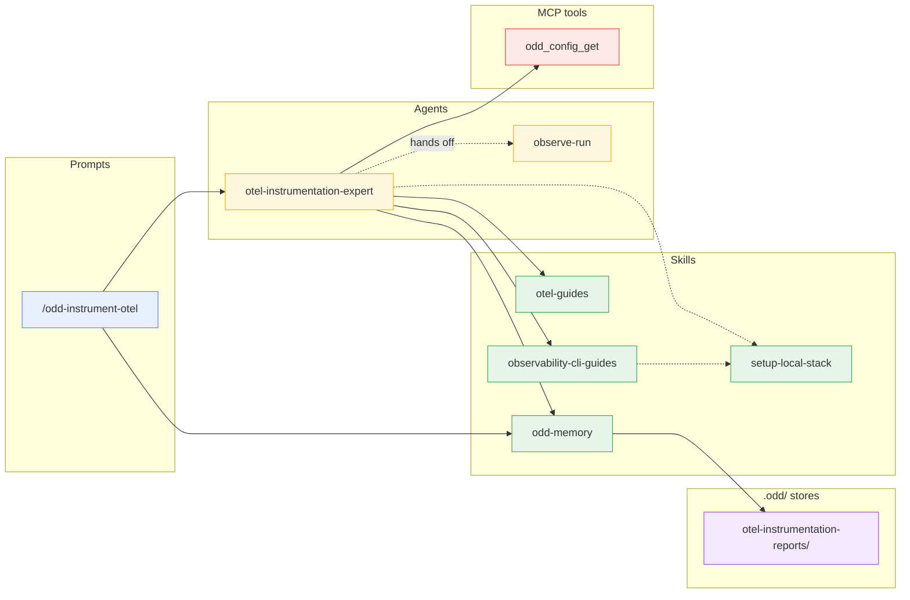
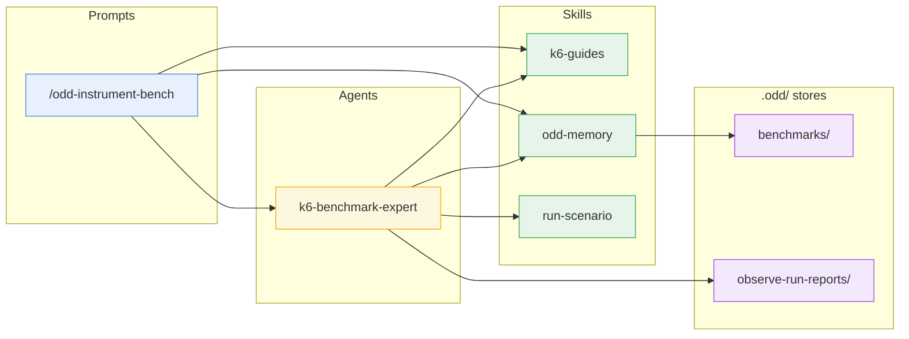
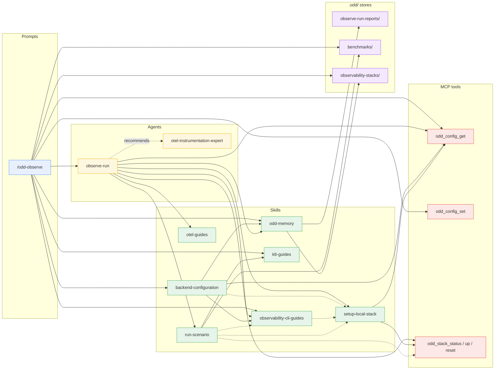
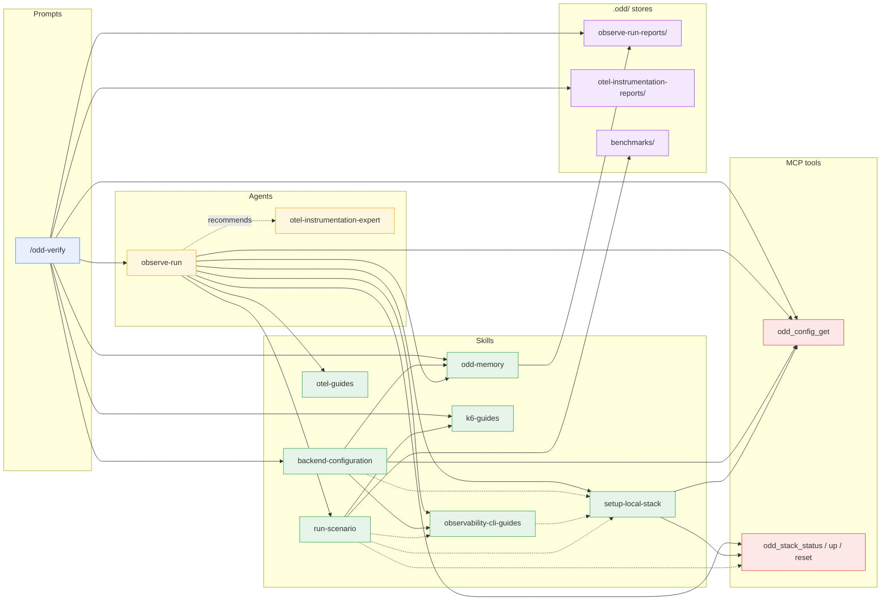
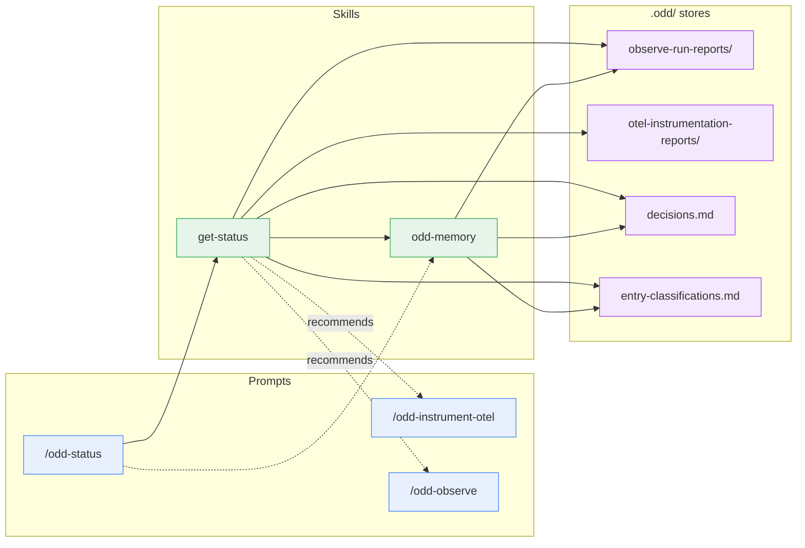
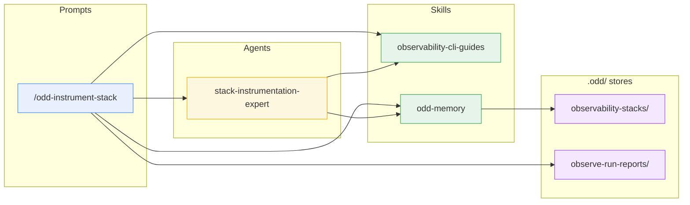
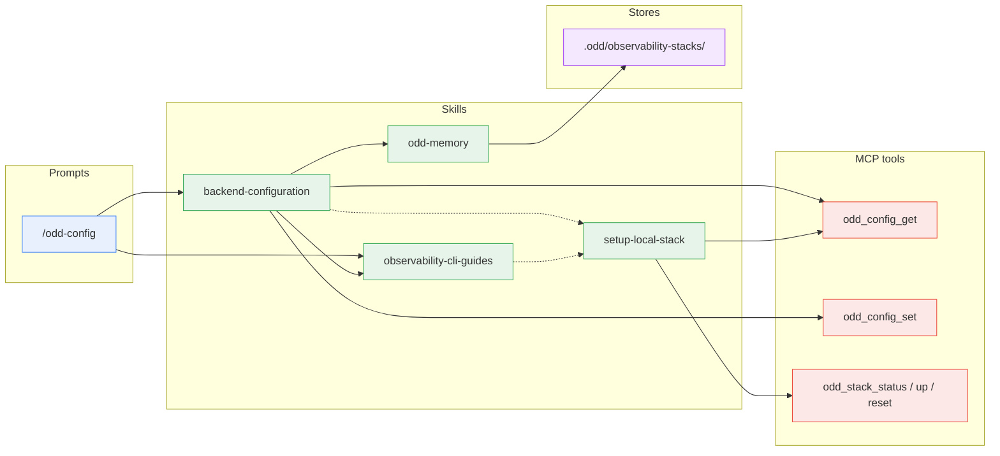
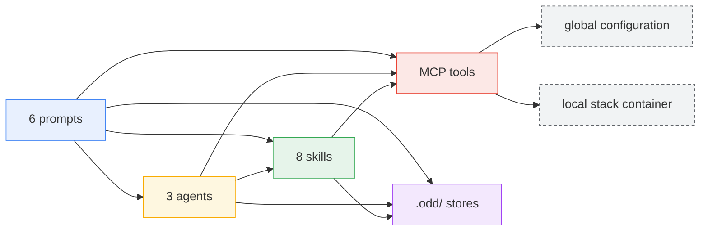

# The oddyssey plugin package

Every component the package ships - prompts, agents, skills, hooks and
the MCP server's tools - with its role, and who invokes what across
them. Every edge matches an actual invocation in the `.apm/` sources;
the per-layer tables and the MCP server's own section near the end are
the component catalog. One diagram per prompt, limited to that prompt's
reachable subgraph; a component from another prompt's path appears as a
**boundary node**, expanded in its own diagram.

## Legend

- **Layers**: prompts (user entry points) - agents (dispatched
  missions) - skills (reusable contracts) - hooks (the guards a host
  runs around a tool call; catalogued below, absent from the diagrams,
  which map invocations) - MCP tools (the oddyssey server piloting the
  local stack and the global configuration) -
  stores (the committed `.odd/` report directories, plus the two
  ruling ledgers `.odd/decisions.md` and `.odd/entry-classifications.md`
  and the benchmark sources under `.odd/benchmarks/`).
- **Edges**: solid `-->` = dispatch or direct invocation; dashed
  `-.->` = routing or contract reference (one component hands over to
  or follows another's rules); dotted with label = recommendation or
  hand-off (one component points the user, or the next step, at
  another).

## /odd-instrument-otel

Dispatches `otel-instrumentation-expert`, which maps services to the
official docs, takes the protocol's queries from the export stack's
`observability-cli-guides` reference (validating them locally through
`setup-local-stack`'s gcx context), persists through
`odd-memory`'s `odd_report.py` (`new --kind instrumentation`, then
`persist`), and closes with the synthesis `odd_report.py show`
renders from the stored report.
`observe-run` is a boundary node: the report hands it the confirmation
of landed signals.

## /odd-instrument-bench

Asks the user what only a human decides, ensures `k6` is present per
`k6-guides`, dispatches `k6-benchmark-expert`, which persists through
`odd-memory`'s `benchmark` reference, and closes with that reference's
synthesis.

## /odd-observe

Preflights in the main conversation - the stack through
`odd_config_get`/`odd_config_set`, the CLI through
`backend-configuration`'s `## Check`, `k6` through `k6-guides` when a
benchmark is named - then dispatches `observe-run` and closes with
the synthesis `odd-memory`'s `odd_report.py show` renders from the
stored report. `observe-run` reads `otel-guides`' generative AI
reference when the traces carry `gen_ai.*` spans.
`otel-instrumentation-expert`
is a boundary node, recommended when a service emits no telemetry.

## /odd-verify

Resolves the baseline across both `.odd/` stores - the report, its
one-hop source, the mode and depth to replay, and whether the code
changed since it (a verification or a re-measure) - through
`odd-memory`'s `odd_report.py` (`baseline`, `boundary`), preflights
against the report's `stack` (never `odd_config_set` here), ensures
`k6` when a drive replay carries a benchmark, dispatches
`observe-run`, and closes with the synthesis the same script's `show`
renders from the stored report. `observe-run` reads `otel-guides`' generative AI
reference when the traces carry `gen_ai.*` spans, as in `/odd-observe`.
`otel-instrumentation-expert`
is the same boundary node as in `/odd-observe`.

## /odd-status

Dispatches no agent: `get-status` renders the loop's state from both
stores, git, and the two ruling ledgers; a ruling — a decision on a
finding, a tree entry classified — is recorded per `odd-memory`'s
`decisions` reference only when the user asks for it, and the prompt
re-renders afterwards. The two recommended prompts are boundary nodes.

## /odd-instrument-stack

Resolves the shape — create, complete, link, or fix from a report's
stack-friction section — the name (a built-in `STACKS` value refused),
the sources in order and how the backend is reached, asks the user
once for what only they can answer, dispatches
`stack-instrumentation-expert`, which writes the guide and the scripts
it names, verifies every invocation live, checks the directory against
the contract and persists through `odd-memory`'s `observability-stack`
reference, and closes with that reference's synthesis and the offer to
switch.

## /odd-config

Displays through `backend-configuration`'s `## Check` and routes a
switch to its `## Switch`, which ends in `## Check` for the connection
proof; a missing CLI binary or a targeting value that fails to resolve
routes the other way, inside the same skill. A custom stack's guide
(`odd-memory`'s `observability-stack` reference) is the target's
reference, checked against the contract before the switch — the
prompt lists the custom stacks the repository carries and switches to
them; writing one is `/odd-instrument-stack`'s.

## Prompts

The user entry points. Each builds a mission from the arguments, runs
its preflight in the main conversation, dispatches (or routes to
skills), and closes with a show skill's synthesis of what was stored.

| Prompt | Role | Invokes |
| --- | --- | --- |
| [`/odd-instrument-otel`](../../.apm/prompts/odd-instrument-otel.prompt.md) | Entry point: point the `otel-instrumentation-expert` agent at a codebase | `package-layout` (`layout.py`, for the mission block's `Skills:` line); `otel-instrumentation-expert`; `odd-memory` (`odd_report.py show` on the stored report) |
| [`/odd-instrument-bench`](../../.apm/prompts/odd-instrument-bench.prompt.md) | Entry point: ask what only a human decides, ensure `k6`, then point the `k6-benchmark-expert` agent at a service | `package-layout` (`layout.py`, for the mission block's `Skills:` line); `k6-benchmark-expert`; `k6-guides` (`authoring-inputs.md`, `install.md`); `odd-memory` (the `benchmark` reference: its `## Show`, and its recall when new-versus-update is ambiguous) |
| [`/odd-observe`](../../.apm/prompts/odd-observe.prompt.md) | Entry point: resolve the stack - built-in or custom - prove the CLI connected, resolve the depth, build the mission and invoke the `observe-run` agent | `package-layout` (`layout.py`, for the mission block's `Skills:` line); `observe-run`; `backend-configuration` (`## Check`; `## Switch` step 3 for a named custom stack); `observability-cli-guides` (`builtin-stacks.md`); `k6-guides` (`install.md`); `odd-memory` (`odd_report.py show` on the stored report, for the closing synthesis); `odd_config_get`, `odd_config_set`; reads `.odd/benchmarks/`, `.odd/observability-stacks/` |
| [`/odd-verify`](../../.apm/prompts/odd-verify.prompt.md) | Entry point: replay a stored report's protocol through the `observe-run` agent and rule on everything it recorded; preflights against the report's stack and asks before a remote drive replay | `package-layout` (`layout.py`, for the mission block's `Skills:` line); `observe-run`; `backend-configuration` (`## Check`); `k6-guides` (`install.md`); `odd-memory` (the `observe-run-report` reference's `## Resolving a replay`: `odd_report.py baseline` and `boundary` in the preflight, `show` on the stored report for the closing synthesis); `odd_config_get` |
| [`/odd-status`](../../.apm/prompts/odd-status.prompt.md) | Where is the loop? Rendered from the `.odd/` history and git alone — one screen by default, the full tables on request; records the maintainer's rulings — a decision on a finding, a tree entry classified runtime or non-runtime. Dispatches no agent | `get-status`; `odd-memory` (the `decisions` reference) when, and only when, the user asks for a ruling, then re-renders |
| [`/odd-instrument-stack`](../../.apm/prompts/odd-instrument-stack.prompt.md) | Entry point: resolve the shape (create, complete, link, fix from report), the name and the sources, ask once how the backend is reached, then point the `stack-instrumentation-expert` agent at it | `package-layout` (`layout.py`, for the mission block's `Skills:` line); `stack-instrumentation-expert`; `observability-cli-guides` (`builtin-stacks.md`, to refuse a built-in name); `odd-memory` (the `observability-stack` reference's `## Show`; the report script's `read --sections 1,8` for a fix from a report); reads `.odd/observability-stacks/`, `.odd/observe-run-reports/` |
| [`/odd-config`](../../.apm/prompts/odd-config.prompt.md) | Show the configured backend - stack, targeted instance, connection proof - and guide a backend switch, custom stacks listed as switch targets; never writes a stack | `backend-configuration` (`## Check` to display, `## Switch` when the user picks a backend); `observability-cli-guides` (`builtin-stacks.md`); reads `.odd/observability-stacks/` |

## Agents

The dispatched missions. They investigate and report, never modify
the code, and persist through the create skills that own the stores.

| Agent | Role | Invokes |
| --- | --- | --- |
| [`otel-instrumentation-expert`](../../.apm/agents/otel-instrumentation-expert.agent.md) | Investigate a codebase and hand back every input for a spec-driven plan to implement OpenTelemetry | `package-layout` (`layout.py`, when dispatched without a `Skills:` line); `otel-guides` (the language references; the generative AI reference when a manifest names a model SDK); `observability-cli-guides` (the export stack's query surface, for the protocol's queries); routes to `setup-local-stack` to validate a query on the local stack; `odd-memory` (the `otel-instrumentation-report` reference, whose `odd_report.py new --kind instrumentation` and `persist` write the report; the `observability-stack` reference to read a custom stack's guide by section); `odd_config_get`; hands the confirmation of landed signals off to `observe-run` |
| [`observe-run`](../../.apm/agents/observe-run.agent.md) | Observe a running service through its telemetry, on the local stack, a remote backend or a custom stack, and hand back every input for a plan of fixes | `package-layout` (`layout.py`, when dispatched without a `Skills:` line); `observability-cli-guides` (the stack's reference, and the query scripts it ships); `otel-guides` (the generative AI reference's hard facts, when the traces carry `gen_ai.*` spans); `setup-local-stack`; `run-scenario` (ad-hoc requests, or a stored benchmark run unmodified); `odd-memory` (the `observe-run-report` reference and its `odd_report.py` - `new` writes the report file, `read` reads the baseline by section, `persist` commits it, `--custom-stack` adds the stack-friction section a run fills instead of editing the stack; the `observability-stack` reference to read a custom stack's guide by section); `odd_config_get`; `odd_stack_status` / `odd_stack_up` / `odd_stack_reset`; recommends `otel-instrumentation-expert` when a named service emits no telemetry at all |
| [`k6-benchmark-expert`](../../.apm/agents/k6-benchmark-expert.agent.md) | Investigate a service and author its k6 benchmark as reviewed code, validated but never run as a benchmark | `package-layout` (`layout.py`, when dispatched without a `Skills:` line); `k6-guides` (`scripting.md`, `running-tests.md`, `mcp.md` for an MCP target); `odd-memory` (the `benchmark` reference); `run-scenario` (`run-identity.md` for the identity headers the authored script must build, `benchmark-replay.md` for what a replay may not change); reads `.odd/observe-run-reports/` for the service's hot operations |
| [`stack-instrumentation-expert`](../../.apm/agents/stack-instrumentation-expert.agent.md) | Author a custom stack as a directory - the guide and the query scripts it names - every invocation verified live against the backend; complete, link or fix one from a report's stack-friction section; never queries a stack on a mission's behalf | `package-layout` (`layout.py`, when dispatched without a `Skills:` line); `observability-cli-guides` (`CONTRACT.md`, its `## A custom stack` section, its check script, one shipped stack script as the model); `odd-memory` (the `observability-stack` reference: persist and `## Show`); writes `.odd/observability-stacks/` |

## Skills

The reusable contracts. A skill invokes another only where an edge is
drawn: the guides and the show skills invoke nothing, the create
skills own their store, and the two configuration skills route to
each other.

| Skill | Role | Invokes |
| --- | --- | --- |
| [`package-layout`](../../.apm/skills/package-layout/SKILL.md) | Where this package is installed and what each part of it is - the skills' root, the sibling directories the install carries, and per skill its `SKILL.md`, its references and its scripts; owns the script that answers it (`scripts/layout.py`: nothing in, the installation's map out - read from the script's own location, so no path is hardcoded and nothing is searched for) | Nothing - read by the prompts' preflights for the mission block's `Skills:` line, and by an agent dispatched without one |
| [`otel-guides`](../../.apm/skills/otel-guides/SKILL.md) | Curated map of the official OpenTelemetry docs: every supported language plus the cross-language guides (SDK configuration, semantic conventions, generative AI conventions and instrumentation libraries, Collector deployment, profiling) | Nothing - read by `otel-instrumentation-expert`, and by `observe-run` for the generative AI reference |
| [`k6-guides`](../../.apm/skills/k6-guides/SKILL.md) | Curated map of the official k6 docs: install, running a script, scripting (checks, thresholds, scenarios), test types, protocols - including driving an MCP server - and which of a benchmark's inputs a human must decide rather than an agent; owns the script that replays a stored benchmark (`scripts/replay_benchmark.py`: the manifest in, the k6 command built and run and the replay's record out - refusing the flags that would silently edit the benchmark) | Nothing |
| [`odd-memory`](../../.apm/skills/odd-memory/SKILL.md) | The `.odd/` memory: the contract every kind shares, and one reference per kind - observation reports, instrumentation reports, the maintainer-ruling ledgers, benchmarks, custom stacks - saying how to persist, recall and show it; owns the five stores, the script that writes, checks, reads, persists and shows an observation report (`scripts/odd_report.py`: the run's values in, the file's path out, then `check`, `read`, `persist`, `synthesis`, `show` on that path; `baseline` and `boundary` for a replay's preflight - the one reader of the report format, imported by `odd_recall.py`, `odd_ledger.py` and `get-status`'s `odd_status.py`), the script that lists the stored reports and benchmarks a recall considers (`scripts/odd_recall.py`: the mission's scope in, the matches newest first out, one line each), and the script that writes the two ruling ledgers (`scripts/odd_ledger.py`: resolve a finding, record a decision or its reversal, classify a tree entry, checked before the row lands - it reads the global configuration's `stack_config` values, read-only and failing open, so a rationale never carries one) | Nothing - read by the three agents at persist and recall time, by the prompts at show time, by `get-status`, by `backend-configuration` for a custom stack; never invoked on its own |
| [`observability-cli-guides`](../../.apm/skills/observability-cli-guides/SKILL.md) | One reference per stack - query surface, configuration display, what to persist - plus the built-in stack list: the local stack, Grafana (gcx), Datadog (Pup), Dynatrace (dtctl), Azure Monitor (az), CloudWatch (aws); the reference contract every stack reference follows - a custom stack's guide and the query scripts it names included - with the script that checks one against it, and the scripts that query a Grafana stack: `grafana-discover.py` (services and a window in, what each signal holds per service out), `grafana-metrics.py` (a metric and a window in, quantiles, settled counter readings or a label's values out), `grafana-traces.py` (services or a TraceQL selector in, per-operation latency with exemplar span trees or deduplicated counts out; `watch` polls a driven run's identity until it has started and ended, resumable from a state file), `grafana-logs.py` (a stream selector in, exact counts, severities, correlation and samples out), `grafana-profiles.py` (a profile selector in, top frames by self and total out), `grafana-context.py` (a gcx context name in, the proved config to query through out - the user's own in place when the context is current, a per-session copy with datasource defaults otherwise); the reference names them, a mission runs them instead of composing gcx calls; and the scripts that query Azure Monitor the same way: `azure-monitor-discover.py` (the component and workspace tables a window holds per service, the environment read off the resource attributes), `azure-monitor-traces.py` (the per-operation table from `requests`, the dependencies joined on `operation_Id`, exemplars, a trace tree), `azure-monitor-metrics.py` (`customMetrics` with the temporality probe, platform metrics with their definitions), `azure-monitor-logs.py` (the workspace's `*_CL` tables and the component's `traces`, a `kql` escape hatch), `azure-monitor-context.py` (the two-part connection proof, the landing poll); and the scripts that query CloudWatch and X-Ray: `cloudwatch-discover.py` (the log groups' freshness and records per service, the EMF namespaces and dimension sets, the service graph, the profiling gap), `cloudwatch-traces.py` (one summaries call split client-side into the per-operation table with client-side percentiles, trace trees batched by five, the service graph's histograms), `cloudwatch-metrics.py` (the EMF temporality probe and the window's edge diffs or sums per full dimension set, `get-metric-data` through a queries file), `cloudwatch-logs.py` (Logs Insights with the poll inside, `filter-log-events`, the route normalisation, a `query` escape hatch), `cloudwatch-context.py` (the connection proof with its SSO diagnoses, the landing proofs per signal) | Routes the local-stack case to `setup-local-stack` |
| [`setup-local-stack`](../../.apm/skills/setup-local-stack/SKILL.md) | Configure gcx against the local stack without touching the user's contexts, with the datasource UIDs and the push-model caveats; owns the script that writes and proves that context (`scripts/gcx_local.py`: the configured ports in, the isolated context written whole and checked out) and the script that inventories the services (`scripts/probe_services.py`: service names and a window in, per-service signal presence, identity and counter baseline out) | `odd_config_get`; `odd_stack_status` / `odd_stack_up` / `odd_stack_reset` |
| [`backend-configuration`](../../.apm/skills/backend-configuration/SKILL.md) | The configured backend, in two sections: `## Check` displays the configured stack's CLI context, proves it connected, guides the setup and hands the preflight over to the mission; `## Switch` owns the change - CLI presence with a guided install offer, the switch and the per-stack `stack_config` values persisted, then `## Check` for the proof; a custom stack's directory is checked against the reference contract before the switch | `observability-cli-guides` (`builtin-stacks.md`, the stack's four preflight sections, the contract check script); `odd-memory` (the `observability-stack` reference, for a custom stack's directory); `odd_config_get`, `odd_config_set`; routes to `setup-local-stack` for the local stack |
| [`run-scenario`](../../.apm/skills/run-scenario/SKILL.md) | Drive a reproducible request scenario - ad-hoc requests or a stored benchmark - and record it verbatim for the replay; the shared method in `SKILL.md`, the run identity, the long-scenario carve-outs and the benchmark replay as references read by block | `k6-guides` (`running-tests.md`, `install.md`, and its `scripts/replay_benchmark.py` for the replay itself - `run-scenario` carries no k6 tooling of its own); the backend's reference in `observability-cli-guides` for the watch of a run someone else drives, when that backend ships one; reads `.odd/benchmarks/<name>/` (never writes there); orders the clean-base sequence around `odd_stack_reset` and follows `setup-local-stack` |
| [`get-status`](../../.apm/skills/get-status/SKILL.md) | Render the state of the ODD loop from the committed `.odd/` history and git alone, read-only | `odd-memory` (its `odd_report.py`, imported by `odd_status.py` as the report format's one reader; the skills deploy side by side); reads `.odd/observe-run-reports/`, `.odd/otel-instrumentation-reports/`, `.odd/decisions.md` and `.odd/entry-classifications.md` (under `odd-memory`'s `decisions` reference); recommends `/odd-instrument-otel` or `/odd-observe` |

## Hooks

| Hook | Role | Invoked by |
| --- | --- | --- |
| [`odd-guards`](../../.apm/hooks/odd-guards.json), branch guard | Refuse a `git commit` on the default branch, or a `git push` to it, before it runs - the persistence skills' rule made deterministic | The host's pre-tool event, on every target with hooks; never a prompt, agent, or skill |
| [`odd-guards`](../../.apm/hooks/odd-guards.json), append-only guard | Refuse a file tool or a shell command about to modify or delete a report the repository's HEAD holds under `.odd/observe-run-reports/` or `.odd/otel-instrumentation-reports/`, or to write `.odd/decisions.md` or `.odd/entry-classifications.md` by any means but `odd-memory`'s ledger script - AGENTS.md's append-only rule made deterministic; a report not committed yet stays the run's to write, and `.odd/benchmarks/` and `.odd/observability-stacks/` stay outside | The host's pre-tool event, on every target with hooks; never a prompt, agent, or skill |
| [`odd-guards`](../../.apm/hooks/odd-guards.json), `.odd/` scan | After a tool wrote a file under `.odd/`, flag every line carrying a GUID that the report does not declare as an OTel `service.instance.id`, a home-directory path, or a value of the global configuration's `stack_config` - AGENTS.md's no-secrets rule, checked before the report is persisted; the write already happened, the message reaches the agent | The host's post-tool event, on every target with hooks |
| [`odd-guards`](../../.apm/hooks/odd-guards.json), report frontmatter | After a tool wrote a report under `.odd/observe-run-reports/` or `.odd/otel-instrumentation-reports/`, flag what its filename and frontmatter lack against the memory contract - the filename shape, the fields the kind requires and their values, the window, the date and slug the filename carries, the stored report a replay's `verifies` names - the invariant `/odd-status` reads over the history, checked before the report is persisted; the write already happened, the message reaches the agent | The host's post-tool event, on every target with hooks |

A hook deploys with the package; a host can be told not to run it
(`apm deny using-system/oddyssey` before installing, or the host's own
hooks setting).

## The MCP server

One job: **pilot a local Grafana stack with an OpenTelemetry endpoint**.
One container ([grafana/otel-lgtm](https://github.com/grafana/docker-otel-lgtm),
pinned, its definition embedded in the server — Docker is the only
prerequisite) exposes Grafana on `:3000`, OTLP on `:4317`/`:4318`, and
Pyroscope's ingest on `:4040` (profiles are pushed there directly by
pyroscope-io-style SDKs — they are not an OTLP signal); apps export
their telemetry there. Tempo traces, Prometheus metrics, Loki
logs, and Pyroscope profiles are all queried through the Grafana proxy
(`:3000/api/datasources/proxy/uid/...`), so the same paths work against any
Grafana; on remote stacks the backend behind it can be something other
than the local otel-lgtm container.

| Tool | What it does | Params |
| --- | --- | --- |
| `odd_stack_up` | Start the local stack and wait until it is ready | `env` (optional) — container environment; applies at creation only, is persisted in `stack_config.local` (credential-named variables excluded) and reapplied on every recreation |
| `odd_stack_down` | Destroy it — stored telemetry does not survive | — |
| `odd_stack_status` | Probe whether it is up — and get the container's identity too: `image`, `created`/`started` timestamps, and its user-set `env` (credential-named values redacted to `null`; all four `null` when there is no container) — plus `daemon` (`"ok"`, or `"unreachable"` with `daemon_remedy`, the one-line remedy, when the Docker daemon does not answer) | — |
| `odd_stack_reset` | Wipe all stored telemetry and return a fresh, ready stack — the next run starts from a clean slate | `env` (optional) — always applies, the container is recreated; persisted/reapplied like `odd_stack_up` |
| `odd_config_get` | Read the global configuration — stack backend, local host ports, per-stack targeting values, custom stack declarations — and the installed `oddyssey-mcp` version | — |
| `odd_config_set` | Update it — a port change resets the stack so the new value applies right away | `config` — partial merge, e.g. `{"local": {"grafana_port": 3300}}`; inside `stack_config` and `custom`, `null` deletes a key or a stack's entry; a stack outside the built-in list needs a `custom` declaration |

The server is instrumented with OpenTelemetry and, by default, exports its
own traces and metrics to the local stack (`http://localhost:4318`, OTLP
`http/protobuf` — the protocol is fixed, `OTEL_EXPORTER_OTLP_PROTOCOL` set
to anything else is not honored). Any `OTEL_*` variable set in the MCP
client's env block overrides the defaults, and `OTEL_SDK_DISABLED=true`
turns telemetry off entirely. When the stack is down, telemetry is silently
dropped — the normal state, and never a failure of the server.

These six tools are the only components with machine state - the global
configuration and the local container. Every prompt, agent, skill and
hook above is a prose contract.

## Bird's-eye view

Layers only - the per-component edges live in the per-prompt diagrams
above, and so does the intra-layer routing (prompt-to-prompt
recommendations, the agents' mutual hand-off, skill-to-skill routing):
this view keeps only the cross-layer edges. The last block is not a
component layer but the **machine state** the MCP tools sit on - the
global configuration and the local stack container never appear in the
per-prompt diagrams because nothing invokes them directly: every
access goes through the tools.

